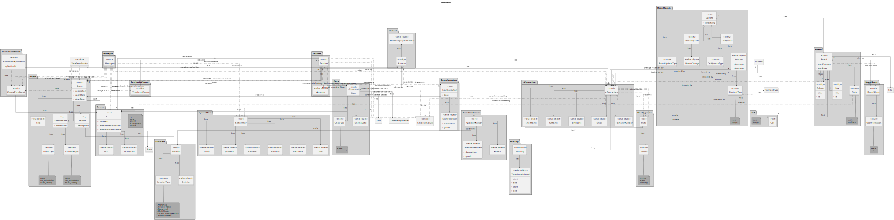

# US G002

**As Project Manager, I want the team to elaborate a Domain Model using DDD**

## 1. Context

*A domain model must be created and maintained updated. The domain model should be included in the techincal documentation of the respository.*

## 2. Requirements

### 2.1. Additional Client Requirements

**US G002** As Project Manager, I want the team to elaborate a Domain Model using DDD

- NFR02. Project documentation should be always available on the project repository ("docs" folder, Markdown format) and, when applicable, in accordance to the UML notation. The development process of every US (e.g.: analysis, design, testing, etc.) must be reported (as part of the documentation).

**US G002.1** As Project Manager, I want the team to elaborate a Glossary

## 3. Analysis

*The team analyzed the project description highlight all potential concepts that were relevant for the business (domain). These concepts were placed in their respecctive aggregates. After this, all functional and non-functional requirements were analyzed in order to determine which associations or dependencies should exist between aggregates and/or entities/events/services.*

## 4. Design

### 4.1. Realization

*This deliverable was produced by all team members in several incremental stages using OO/DDD principles.*

### 4.2. Domain Model Diagram

### 4.3. Applied Patterns

- Aggregate
- Entity
- Value Object
- Repository
- Service

### 4.4. Tests

*NA*

## 5. Implementation

*These requirements are part of the design, and as such do not include any implementation.*

*Major commits:*
- [70024e3] domainModel2.puml-first draft of the domain model concerning the Shared boards and meetings
- [76b1b14] another version od DM (with aggregates) (missing meetings and shareboards)
- [c99d748] Added new version of domain model packages regarding student, teacher, system user, board and cells.
- [e4adfa3] Added some entities relations; Other small changes

## 6. Integration/Demonstration

*This deliverable is part of the design/documentation and as such it does not require integration with other parts/components of the system.*

*This deliverable does not need any scripts or instructions as it is part of the design/documentation.*

## 7. Observations

*The domain model was developed trying to apply DDD principles. There are alternative solutions such as the more widespread usage of events and splitting agreaggates to increase concurrency. We strived to find a balance that would best fit the use cases.*

*During the development of the domain model, we applied design patterns and design choices featured in the domain model of the ecafetaria-spring application.*
