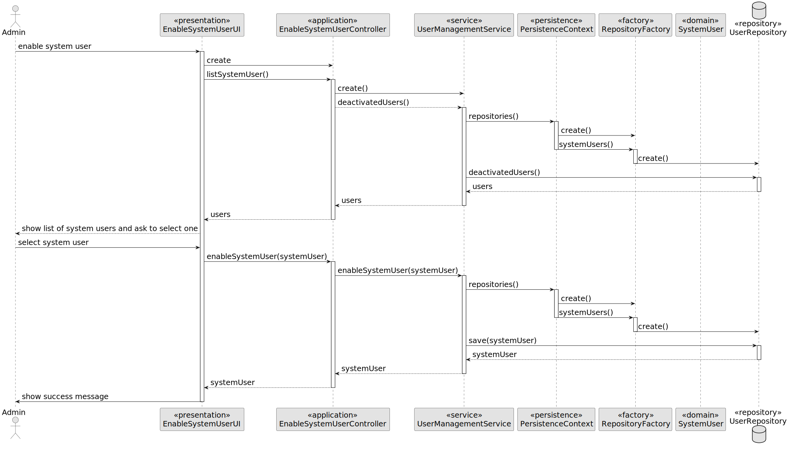

# US 1001

*As a Manager, I want to be able to register, disable/enable, and list users of the system (Teacher, Students, as well as Managers*

## 1. Context
*This task is to be completed in this sprint. It is the first time the task is assigned to be developed.*
*This set of functionalities is related to the management of users. Therefore, it should be only available to managers of the system*

## 2. Requirements

### 2.1. Additional Client Requirements

**US1001** As a Manager, I want to be able to register, disable/enable, and list users of the system (Teacher, Students, as well as Managers)

- FRU01. Management of Users
## 3. Analysis

*In order to execute this operation, the user must be logged in as a manager. The manager must be able to register, disable/enable, and list users of the system (Teacher, Students, as well as Managers).*
*The manager is asked about the the details to be inserted and the system must validate the information and register the user. The manager can also disable/enable users and list users of the system.*

### 3.1 Domain Model Extract

## 4. Design

*In this sections, the team should present the solution design that was adopted to solve the requirement. This should include, at least, a diagram of the realization of the functionality (e.g., sequence diagram), a class diagram (presenting the classes that support the functionality), the identification and rational behind the applied design patterns and the specification of the main tests used to validade the functionality.*

### 4.1. Realization


### 4.1.1. Sequence Diagram
!



### 4.2. Class Diagram


### 4.3. Applied Patterns

Considering the analysis and design of the previous sections, the team decided to apply the following patterns:
- **Factory Method** - to create the class instances
- **Information Expert** - to assign the responsibility of creating the class to the class itself
- **Repository** - to store the classes
- **Pure Fabrication** - to assign the responsibility of checking the availability of the participants of a class to the service class
- **Service** - to check the availability of the participants of a class, and to create the class
- **Value Object** - to represent the class date and time period

### 4.4. Tests

**Test 1:** *Verifies that it is not possible to create an instance of the Example class with null values.*

```
@Test(expected = IllegalArgumentException.class)
public void ensureNullIsNotAllowed() {
	Example instance = new Example(null, null);
}
````

## 5. Implementation


## 6. Integration/Demonstration

* It is needed to be logged as a manager to be able to execute this operation.


## 7. Observations
* We believe the requrements are met, but we will review the solution if needed.