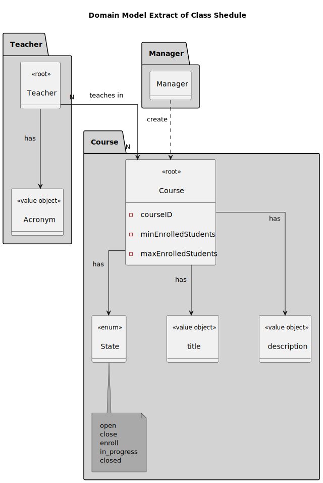
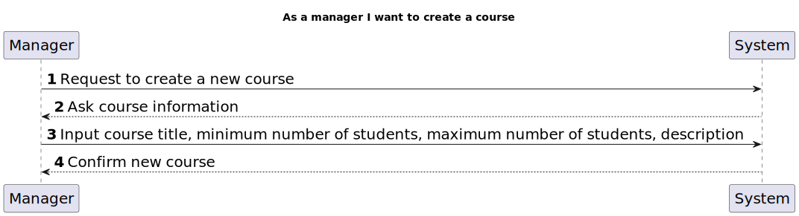

# US 1002

As a manager I want to create courses

## 1. Context

* First time developing this task.

## 2. Requirements
* This task is completely independent.

## 3. Analysis
* A course is characterized by its title and a unique code.
* Different editions of a course are to be considered different course
* Each course may have several teachers and must have only one Teacher in Charge.
* Course workflow 

| Event/Action      | Course state |
|:------------------|:-------------|
| create course     | closed       |
| open course       | open         |
| open enrollments  | enroll       |
| close enrollments | in progress  |
| close course      | closed       |


### 3.1 Acceptance Criteria

> Different editions of a course are to be considered different course


### 3.1 Domain Model


## 4. Design
****
* Use the standard base application structure
* **Domain Classes**
  * Course 
    - ID automatically generated
    - min students
    - max students
    - state (enum)
    - title (Designation type from framework)
  * Teacher
    - 1 to many relation

* **Controller** : CreateCourseController
* **Repository** : CourseRepository

### 4.1. Realization

#### 4.1.1 System Sequence Diagram


#### 4.1.2 Sequence Diagram


### 4.2. Class Diagram


### 4.3. Applied Patterns
Considering the analysis and design of the previous sections, the team decided to apply the following patterns:
- **Dependency Injection** - to inject dependencies
- **Information Expert** - to assign the responsibility of creating the class to the class itself
- **Repository** - to store the classes
- **Pure Fabrication** - to assign the responsibility of coordinating the US to class controller
- **Value Object** - to represent the class attributes title and code
### 4.4. Tests
**Test 1:** *Ensure Course Code Must Not Empty*

```
@Test
public void ensureCourseCodeMustNotBeEmpty() {
System.out.println("must have non-empty course code");

        assertThrows(IllegalArgumentException.class, () -> new Course("", "Java-1", 15, 100, "OO Programming", "15-05-2025"));
    }

    @Test
    public void ensureCourseCodeMustNotBeNull() {
        System.out.println("must have a course code");

        assertThrows(IllegalArgumentException.class, () -> new Course(null, "Java-1", 15, 100, "OO Programming", "15-05-2025"));
    }
````
**Test 2:** *Ensure Course Title Must Not Empty*

```
    @Test
    public void ensureCourseTitleMustNotBeEmpty() {
        System.out.println("must have non-empty course title");

        assertThrows(IllegalArgumentException.class, () -> new Course("Java-1", "", 15, 100, "OO Programming", "15-05-2025"));
    }
````


**Test 3:** *ensure Min students Must Not Be negative*

```
    @Test
    public void ensureMinStudentsMustNotBeNegative() {
        System.out.println("must have non-negative min students");

        assertThrows(IllegalArgumentException.class, () -> new Course("Java-1", "Java-1", -1, 100, "OO Programming", "15-05-2025"));
    }
````
**Test 4:** *ensure Max Students Must Not Be Negative*

```
    @Test
    public void ensureMaxStudentsMustNotBeNegative() {
        System.out.println("must have non-negative max students");

        assertThrows(IllegalArgumentException.class, () -> new Course("Java-1", "Java-1", 15, -1, "OO Programming", "15-05-2025"));
    }
````
**Test 5:** *ensure MinStudents Must Not Be Greater Than Max Students*

```
    @Test
    public void ensureMinStudentsMustNotBeGreaterThanMaxStudents() {
        System.out.println("must have min students less than max students");

        assertThrows(IllegalArgumentException.class, () -> new Course("Java-1", "Java-1", 100, 15, "OO Programming", "15-05-2025"));
    }
````
**Test 6:** *ensure Course Description must Not Be Empty*

```
    @Test
    public void ensureCourseDescriptionMustNotBeEmpty() {
        System.out.println("must have non-empty course description");

        assertThrows(IllegalArgumentException.class, () -> new Course("Java-1", "Java-1", 15, 100, "", "15-05-2025"));
    }
````
**Test 7:** *ensure Course Description Must Not be Null*

```
    @Test
    public void ensureCourseDescriptionMustNotBeNull() {
        System.out.println("must have a course description");

        assertThrows(IllegalArgumentException.class, () -> new Course("Java-1", "Java-1", 15, 100, null, "15-05-2025"));
    }
````
**Test 8:** *ensure Course created Is Closed*

```
    @Test
    public void ensureCourseCreatedIsClosed() {
        final String courseCode = "Java-1";
        final String courseTitle = "Java1";
        final int minStudents = 15;
        final int maxStudents = 100;
        final String courseDescription = "OO Programming";
        final Course course = new Course(courseCode, courseTitle, minStudents, maxStudents, courseDescription, "15-05-2025");
        assertTrue(course.isClosed());

    }
````
**Test 2:** *ensure course Created With An Identity has That Identity*

```
    @Test
    public void ensureCourseCreatedWithAnIdentityHasThatIdentity() {
        System.out.println("ensure identity");
        final String courseCode = "Java-1";
        Course course = new Course(courseCode, "JV1", 15, 100, "OOP", "15-05-2025");
        assertEquals(courseCode, course.identity());
    }
````
**Test 2:** *Ensure Course Title Must Not Empty*

```
    @Test
    public void ensureCourseCreatedWithAnIdentityHasThatIdentity2() {
        System.out.println("ensure identity");
        final String courseCode = "Java-1";
        Course course = new Course(courseCode, "JV1", 15, 100, "OOP", "15-05-2025");
        assertTrue(course.hasIdentity(courseCode));
    }
````
**Test 2:** *Ensure Course Title Must Not Empty*

```
    @Test
    public void ensureCourseCloseDateUsesCorrectDateFormat() {
        System.out.println("ensure date");
        assertThrows(IllegalArgumentException.class, () -> new Course("Jv1", "Jv1", 15, 100, "OOP", "2025-05-15"));
    }
````
**Test 2:** *Ensure Course Title Must Not Empty*

```
    @Test
    public void ensureCourseCloseDateIsNotBeforeToday() {
        System.out.println("ensure date");
        assertThrows(IllegalArgumentException.class, () -> new Course("Jv1", "Jv1", 15, 100, "OOP", "15-05-2020"));
    }
````
**Test 2:** *Ensure Course Title Must Not Empty*

```
//    @Test
//    void ensureCannotOpenCoursePastCloseDate(){
//        Course course = new Course("Java-1", "JV1", 15, 100, "OOP", "15-05-2020");
//       assertThrows(IllegalArgumentException.class, course::openCourse);
//    }
````
**Test 2:** *Ensure Course Title Must Not Empty*

```
    @Test
    public void openCourseTest() {
        Course course = new Course("Java-1", "JV1", 15, 100, "OOP", "15-05-2025");
        course.openCourse();
        assertTrue(course.isOpen());
    }
````
**Test 2:** *Ensure Course Title Must Not Empty*

```
    @Test
    public void closeCourseTest() {
        Course course = new Course("Java-1", "JV1", 15, 100, "OOP", "15-05-2025");
        course.openCourse();
        course.closeCourse();
        assertTrue(course.isClosed());
    }
    
````
**Test 2:** *Ensure Course Title Must Not Empty*

```    
    @Test
    public void isOpenTest(){
        Course course = new Course("Java-1", "JV1", 15, 100, "OOP", "15-05-2025");
        course.openCourse();
        assertTrue(course.isOpen());
    }
    @Test
    public void isClosedTest(){
        Course course = new Course("Java-1", "JV1", 15, 100, "OOP", "15-05-2025");
        assertTrue(course.isClosed());
    }
````
**Test 2:** *Ensure Course Title Must Not Empty*

```
    @Test
    public void ensureThatCloseCourseCannotBeAddedTeachers() {
        Course course = new Course("Java-1", "JV1", 15, 100, "OOP", "15-05-2025");
        final SystemUserBuilder userBuilder = new SystemUserBuilder(new NilPasswordPolicy(), new PlainTextEncoder());

        SystemUser user1 = userBuilder.with("user1", "duMMy1", "dummy", "dummy", "a@b.ror").withRoles(ECourseRoles.TEACHER_USER).build();
        SystemUser user2 = userBuilder.with("user2", "duMMy2", "dummy", "dummy", "user@b.rro").withRoles(ECourseRoles.TEACHER_USER).build();
        SystemUser user3 = userBuilder.with("user3", "duMMy3", "dummy", "dummy", "user1@r.rro").withRoles(ECourseRoles.TEACHER_USER).build();
        Teacher teacher1 = new Teacher(user1,Acronym.valueOf("USER1"),"USER1","USER1",new TPN("123456789"), new Date(), EmailAddress.valueOf("a@b.ror"));
        Teacher teacher2 = new Teacher(user2,Acronym.valueOf("USER2"),"USER2","USER2",new TPN("123456780"), new Date(), EmailAddress.valueOf("user@b.rro"));
        Teacher teacher3 = new Teacher(user3,Acronym.valueOf("USER3"),"USER3","USER3",new TPN("123456769"), new Date(), EmailAddress.valueOf("user1@r.rro"));
        Set<Teacher> teacherSet= new HashSet<>();
        teacherSet.add(teacher1);
        teacherSet.add(teacher2);
        teacherSet.add(teacher3);
        assertThrows(RuntimeException.class, () -> course.addTeachers(teacherSet));

    }
````
**Test 2:** *Ensure Course Title Must Not Empty*

```
    @Test
    public void addTeachers() {
        Course course = new Course("Java-1", "JV1", 15, 100, "OOP", "15-05-2025");
        final SystemUserBuilder userBuilder = new SystemUserBuilder(new NilPasswordPolicy(), new PlainTextEncoder());
        SystemUser user1 = userBuilder.with("user1", "duMMy1", "dummy", "dummy", "a@b.ror").withRoles(ECourseRoles.TEACHER_USER).build();
        SystemUser user2 = userBuilder.with("user2", "duMMy2", "dummy", "dummy", "user@b.rro").withRoles(ECourseRoles.TEACHER_USER).build();
        SystemUser user3 = userBuilder.with("user3", "duMMy3", "dummy", "dummy", "user1@r.rro").withRoles(ECourseRoles.TEACHER_USER).build();
        Teacher teacher1 = new Teacher(user1,Acronym.valueOf("USER1"),"USER1","USER1",new TPN("123456789"), new Date(), EmailAddress.valueOf("a@b.ror"));
        Teacher teacher2 = new Teacher(user2,Acronym.valueOf("USER2"),"USER2","USER2",new TPN("123456780"), new Date(), EmailAddress.valueOf("user@b.rro"));
        Teacher teacher3 = new Teacher(user3,Acronym.valueOf("USER3"),"USER3","USER3",new TPN("123456769"), new Date(), EmailAddress.valueOf("user1@r.rro"));
        Set<Teacher> teacherSet= new HashSet<>();
        teacherSet.add(teacher1);
        teacherSet.add(teacher2);
        teacherSet.add(teacher3);
        course.openCourse();
        course.addTeachers(teacherSet);
````

    }

## 5. Implementation

*In this section the team should present, if necessary, some evidencies that the implementation is according to the
design. It should also describe and explain other important artifacts necessary to fully understand the implementation
like, for instance, configuration files.*

*It is also a best practice to include a listing (with a brief summary) of the major commits regarding this
requirement.*

## 6. Integration/Demonstration

*In this section the team should describe the efforts realized in order to integrate this functionality with the other
parts/components of the system*

*It is also important to explain any scripts or instructions required to execute an demonstrate this functionality*

## 7. Observations

*This section should be used to include any content that does not fit any of the previous sections.*

*The team should present here, for instance, a critical prespective on the developed work including the analysis of
alternative solutioons or related works*

*The team should include in this section statements/references regarding third party works that were used in the
development this work.*