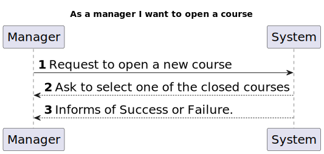
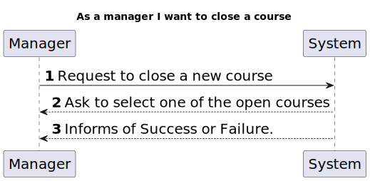
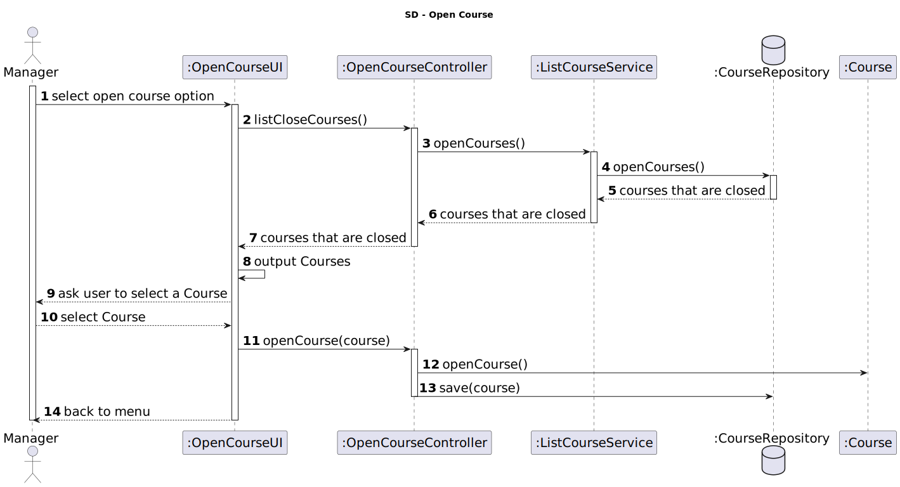

# US 1004

*As a manager I want to open or close a course*

## 1. Context

* First time developing this task.

## 2. Requirements

* This task depends on the pre-existence od the course.

## 3. Analysis

* A course is created with a close state and needs to be open to have activities.
* A course is closed, so it doesn't have activities.
* A course should not be open if it past its end date.

## 4. Design
****
* Use the standard base application structure
* **Domain Classes:**
    * Course
* **Controller:** 
    * OpenCourseController
    * CloseCourseController
* **Service:** 
    * ListCourseService 
* **Repository** 
    * CourseRepository

### 4.1. Realization
#### 4.1.1 System Sequence Diagram
* Open Course
  
* Close Course
  
#### 4.1.2 Sequence Diagram
* Open Course
  
* Close Course
  

### 4.2. Class Diagram


### 4.3. Applied Patterns
Considering the analysis and design of the previous sections, the team decided to apply the following patterns:
- **Dependency Injection** - to inject dependencies
- **Information Expert** - to assign the responsibility of opening and close to the class itself
- **Repository** - to store the classes
- **Pure Fabrication** - to assign the responsibility of coordinating the US to class controller
- **Service** - to list all opened/closed courses
### 4.4. Tests

**Test 1: <br>** 
Ensure that a course with a closed date that is before the today date cannot be open.
```
    @Test
    void ensureCannotOpenCoursePastCloseDate(){
        Course course = new Course("Java-1", "JV1", 15, 100, "OOP", "15-05-2020");
       assertThrows(IllegalArgumentException.class, course::openCourse);
    }
```
**Test 2: <br>**
Ensure a course is open.
```
@Test
    void openCourseTest() {
        Course course = new Course("Java-1", "JV1", 15, 100, "OOP", "15-05-2025");
        course.openCourse();
        assertTrue(course.isOpen());
    }
    
```
**Test 3: <br>**
Ensure a course is closed.
```
    @Test
    void closeCourseTest() {
        Course course = new Course("Java-1", "JV1", 15, 100, "OOP", "15-05-2025");
        course.openCourse();
        course.closeCourse();
        assertTrue(course.isClosed());
    }
```
## 5. Implementation

*In this section the team should present, if necessary, some evidencies that the implementation is according to the design. It should also describe and explain other important artifacts necessary to fully understand the implementation like, for instance, configuration files.*

*It is also a best practice to include a listing (with a brief summary) of the major commits regarding this requirement.*

## 6. Integration/Demonstration

*In this section the team should describe the efforts realized in order to integrate this functionality with the other parts/components of the system*

*It is also important to explain any scripts or instructions required to execute an demonstrate this functionality*

## 7. Observations

*This section should be used to include any content that does not fit any of the previous sections.*

*The team should present here, for instance, a critical prespective on the developed work including the analysis of alternative solutioons or related works*

*The team should include in this section statements/references regarding third party works that were used in the development this work.*