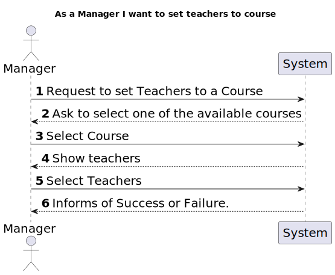
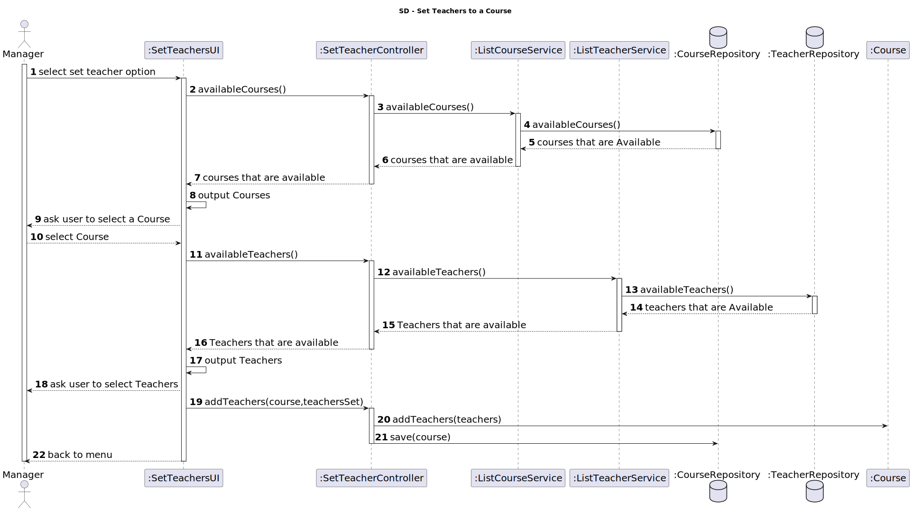

# US 1005

*As Manager, I want to set Teachers of a course*

## 1. Context

* First time developing this task.

## 2. Requirements

* This task depends on the pre-existence od the course and teachers. 


## 3. Analysis

* 
## 4. Design
****
* Use the standard base application structure
* **Domain Classes:**
    * Course
    * Teacher
* **Controller:**
    * SetTeachersController
* **Service:**
    * ListTeachersService
* **Repository**
    * CourseRepository
    * TeacherRepository

### 4.1. Realization
#### 4.1.1 System Sequence Diagram
  

#### 4.1.2 Sequence Diagram
  
### 4.2. Class Diagram


### 4.3. Applied Patterns
Considering the analysis and design of the previous sections, the team decided to apply the following patterns:
- **Dependency Injection** - to inject dependencies
- **Information Expert** - to assign the responsibility of set his teachers to the class itself
- **Repository** - to store the classes
- **Pure Fabrication** - to assign the responsibility of coordinating the US to class controller
- **Service** - to list all teachers and courses available
### 4.4. Tests

**Test 1:** *Verifies that it is not possible to create an instance of the Example class with null values.*

```
@Test(expected = IllegalArgumentException.class)
public void ensureNullIsNotAllowed() {
	Example instance = new Example(null, null);
}
````

## 5. Implementation

*In this section the team should present, if necessary, some evidencies that the implementation is according to the design. It should also describe and explain other important artifacts necessary to fully understand the implementation like, for instance, configuration files.*

*It is also a best practice to include a listing (with a brief summary) of the major commits regarding this requirement.*

## 6. Integration/Demonstration

*In this section the team should describe the efforts realized in order to integrate this functionality with the other parts/components of the system*

*It is also important to explain any scripts or instructions required to execute an demonstrate this functionality*

## 7. Observations

*This section should be used to include any content that does not fit any of the previous sections.*

*The team should present here, for instance, a critical prespective on the developed work including the analysis of alternative solutioons or related works*

*The team should include in this section statements/references regarding third party works that were used in the development this work.*