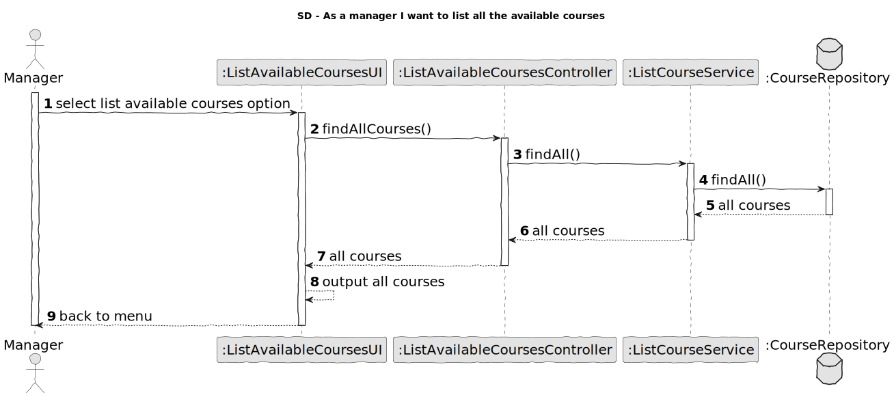
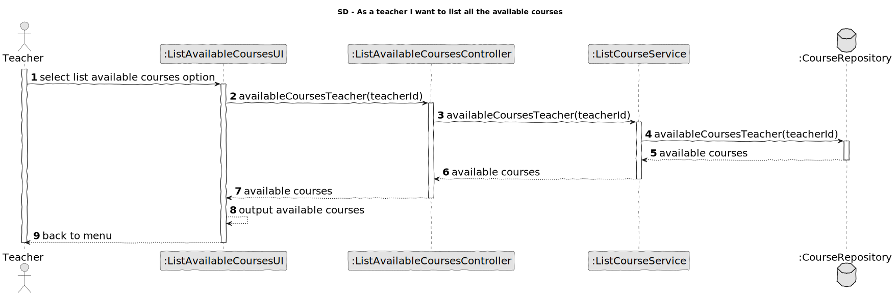

# US 1006

*As a user, I want to list all the courses that are available to me*

## 1. Context

First time developing this task. 
## 2. Requirements

This task depends on:
* The pre-existence od the course.
*  The state of the course.
* Enrollments on a course.

### 2.1 Requirements gathered on client meetings 
> Question:
>>Good morning, <br>
> Relative to this US, "As User, I want to list all the courses that are available to me" what should we list according to the User role? <br>
> Student: Courses that Student is enrolled <br>
> Teacher: Courses that Teacher teaches <br>
> Manager: All Courses <br>
> Are these assumptions right? <br>
> Thank you <br>
> Group 2 
>
> Answer:
>> Hello José.<br>
> Regarding Teachers and Managers I agree with you. <br>
> Regarding students I think it is best to list all the courses in which the student is enrolled or may be enrolled (the enrolments are opened). If not, how would a student know the courses in which he/she can enrol? <br>
> Regards.
> 

## 3. Analysis

*In this section, the team should report the study/analysis/comparison that was done in order to take the best design decisions for the requirement. This section should also include supporting diagrams/artifacts (such as domain model; use case diagrams, etc.),*

## 4. Design
****
* Use the standard base application structure.
* **Domain Classes:**
  * Course
  * Student
  * Teacher
  * CourseEnrollment
* **Controller:**
  * ListAvailableCoursesController
* **Service:**
  * ListCourseService
  * ListCourseEnrollmentService
* **Repository**
  * CourseRepository
  * CourseEnrolmentService

### 4.1. Realization
#### 4.1.1 System Sequence Diagram
  
#### 4.1.2 Sequence Diagram
* Manager
  
* Teacher
  
* Student
  
### 4.2. Class Diagram


### 4.3. Applied Patterns
Considering the analysis and design of the previous sections, the team decided to apply the following patterns:
- **Dependency Injection** - to inject dependencies
- **Information Expert** - to assign the responsibility of getting the courses to the classes itself
- **Repository** - to store the classes
- **Pure Fabrication** - to assign the responsibility of coordinating the US to class controller
- **Service** - to list all  courses
### 4.4. Tests

**Test 1:** *Verifies that it is not possible to create an instance of the Example class with null values.*

```
@Test(expected = IllegalArgumentException.class)
public void ensureNullIsNotAllowed() {
	Example instance = new Example(null, null);
}
````

## 5. Implementation

*In this section the team should present, if necessary, some evidencies that the implementation is according to the design. It should also describe and explain other important artifacts necessary to fully understand the implementation like, for instance, configuration files.*

*It is also a best practice to include a listing (with a brief summary) of the major commits regarding this requirement.*

## 6. Integration/Demonstration

*In this section the team should describe the efforts realized in order to integrate this functionality with the other parts/components of the system*

*It is also important to explain any scripts or instructions required to execute an demonstrate this functionality*

## 7. Observations

*This section should be used to include any content that does not fit any of the previous sections.*

*The team should present here, for instance, a critical prespective on the developed work including the analysis of alternative solutioons or related works*

*The team should include in this section statements/references regarding third party works that were used in the development this work.*