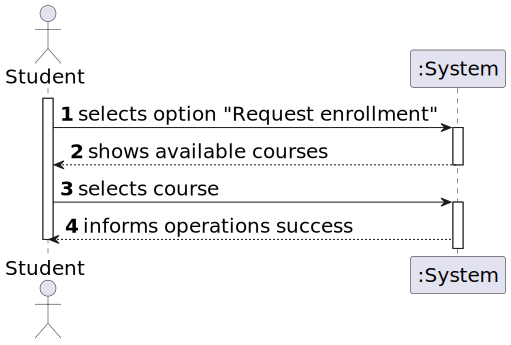
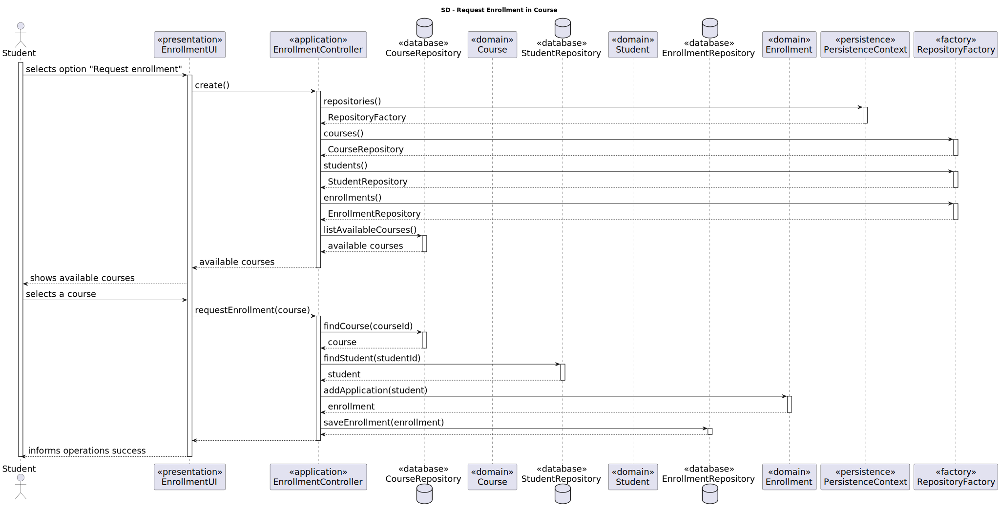
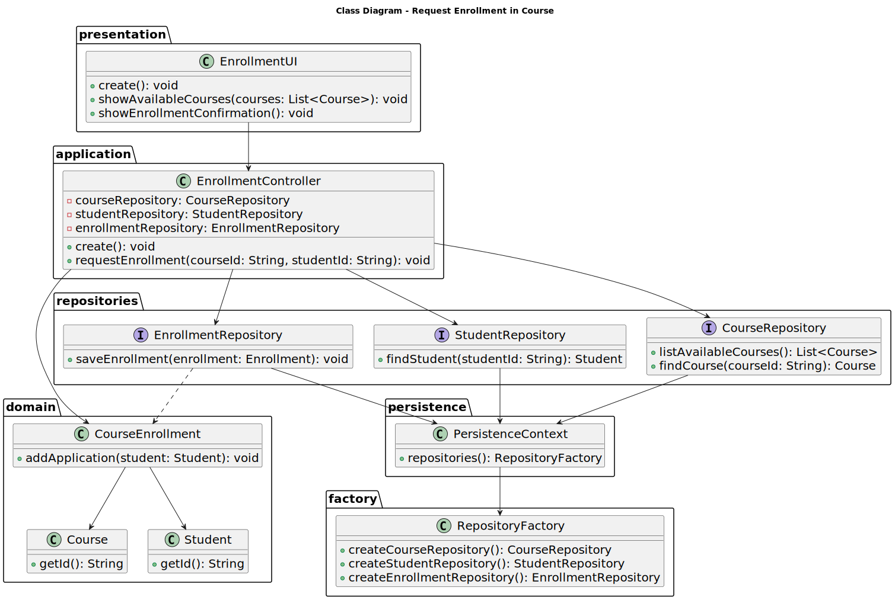

# US 1008

FRC07 - **Request Enrollment in Course** The student requests to be enrolled in a course

## 1. Context

*It is the first time the task is assigned to be developed.*

## 2. Requirements

**US 1008** As Student, I want to request my enrollment in a course.

**Regarding this requirement we understand that it relates to the following requirements:**

- [US 1002](../us_1002/readme.md) - As Manager, I want to create courses.
- [US 1003](../us_1003/readme.md) - As Manager, I want to open and close enrollements in courses.
- [US 1006](../us_1006/readme.md) - As User, I want to list all the courses that are available to me.

## 3. Analysis

*We understand that for the student to request a course enrollment, the course needs to be created first. Therefore, we need to implement the functionality to create courses first.*
*We also understand that the manager needs to be able to open enrollments in a course. Therefore, we need to implement the functionality to open and close enrollments in a course first.*
*We also understand that the student needs to be able to list the courses that are available to him/her. Therefore, we need to implement the functionality to list courses first.*

### 3.1. Domain Model Extract

na

### 3.2. System Sequence Diagram



## 4. Design

### 4.1. Realization



### 4.2. Class Diagram



### 4.3. Applied Patterns

### 4.4. Tests

To be implemented.

## 5. Implementation

```
    @Override
    protected boolean doShow() {
        // list available courses first
        final Iterable<Course> availableCoursesStudent = ctrl.availableCourses();
        if (!availableCoursesStudent.iterator().hasNext()) {
            System.out.println("There are no available Courses.");
        } else {
            final SelectWidget<Course> selector = new SelectWidget<>("Select one of the courses:",availableCoursesStudent,new CoursePrinter());
            selector.show();
            Course course = selector.selectedElement();
            try {
                if (course != null){
                    // request enrollment in a course
                    ctrl.addApplication(course);
                }
            }catch (ConcurrencyException ex){
                System.out.println("WARNING: It is not possible to edit the course enrollment details because it was changed by another user");
            } catch (final IntegrityViolationException ex) {
                LOGGER.error("Error performing the operation", ex);
                System.out.println("Unfortunately there was an unexpected error in the application. Please try again and if the problem persists, contact your system admnistrator.");
            }
        }
        return true;
    }
```

## 6. Integration/Demonstration

*In this section the team should describe the efforts realized in order to integrate this functionality with the other parts/components of the system*

*It is also important to explain any scripts or instructions required to execute an demonstrate this functionality*

## 7. Observations

*Needs further work to correct saving the new enrollment to the repository.*