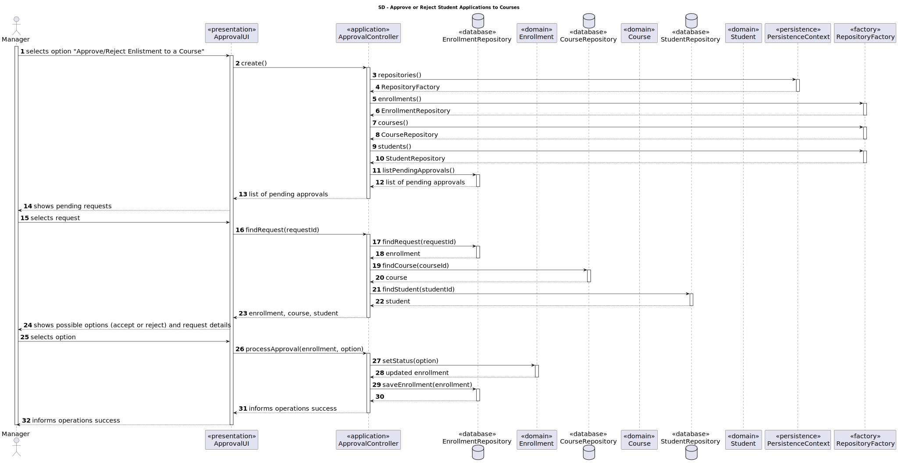
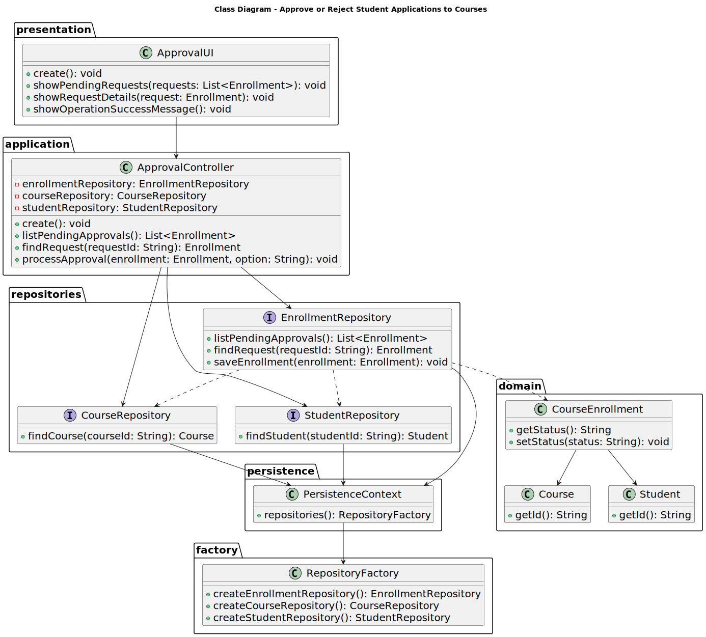

# US 1009

- FRC08 - **Approve/Reject Enlistment in Course** A manager approves or rejects a students’ application to a course.

## 1. Context

*It is the first time the task is assigned to be developed.*

## 2. Requirements

**US 1009** As Manager, I want to approve or reject students applications to courses.

**Regarding this requirement we understand that it relates to the following requirements:**

- [US 1008](../us_1008/readme.md) - As Student, I want to request my enrollment in a course.

## 3. Analysis

### 3.1. Domain Model

### 3.2. Requirements Realization


## 4. Design

### 4.1. Realization



### 4.2. Class Diagram



### 4.3. Applied Patterns

### 4.4. Tests

To be implemented.

## 5. Implementation

*In this section the team should present, if necessary, some evidencies that the implementation is according to the design. It should also describe and explain other important artifacts necessary to fully understand the implementation like, for instance, configuration files.*

*It is also a best practice to include a listing (with a brief summary) of the major commits regarding this requirement.*

## 6. Integration/Demonstration

```
    @Override
    protected boolean doShow() {
        String accept = "accept";
        String reject = "reject";
        final Iterable<Course> courses = ctrl.openCourses();
        if (!courses.iterator().hasNext()) {
            System.out.println("There are no open Courses.");
        } else {
            // show the list of courses
            final SelectWidget<Course> selector = new SelectWidget<>("Select one of the courses:",courses,new CoursePrinter());
            selector.show();
            // get the selected course
            Course course = selector.selectedElement();
            // get the course enrollment of the selected course
            Optional<CourseEnrollment> option = ctrl.findByCourse(course);
            if (option.isEmpty()){throw new IllegalArgumentException("The course does not have an enrollment yet");};
            CourseEnrollment courseEnrollment = option.get();
            final Iterable<EnrollmentApplication> enrollmentApplications = ctrl.listPendingApprovals(courseEnrollment);
            // show the list of pending applications of the selected course
            final SelectWidget<EnrollmentApplication> applications = new SelectWidget<>("Select one of the pending applications:",enrollmentApplications,new EnrollmentApplicationPrinter());
            EnrollmentApplication application = applications.selectedElement();
            // show the list of states to select
            final SelectWidget<String> status = new SelectWidget<>("Select the action:", Set.of(accept,reject));
            status.show();
            try {
                if (application != null && accept.equals(status.selectedElement())){
                    // change the status of the selected application
                    ctrl.processApproval(courseEnrollment, application, true);
                }else if (application != null && reject.equals(status.selectedElement())){
                    // change the status of the selected application
                    ctrl.processApproval(courseEnrollment, application, false);
                }
            }catch (ConcurrencyException ex){
                System.out.println("WARNING: It is not possible to edit the course details because it was changed by another user");
            } catch (final IntegrityViolationException ex) {
                LOGGER.error("Error performing the operation", ex);
                System.out.println("Unfortunately there was an unexpected error in the application. Please try again and if the problem persists, contact your system admnistrator.");
            }
        }
        return true;
    }

```

## 7. Observations

*Further testing and error correction required*