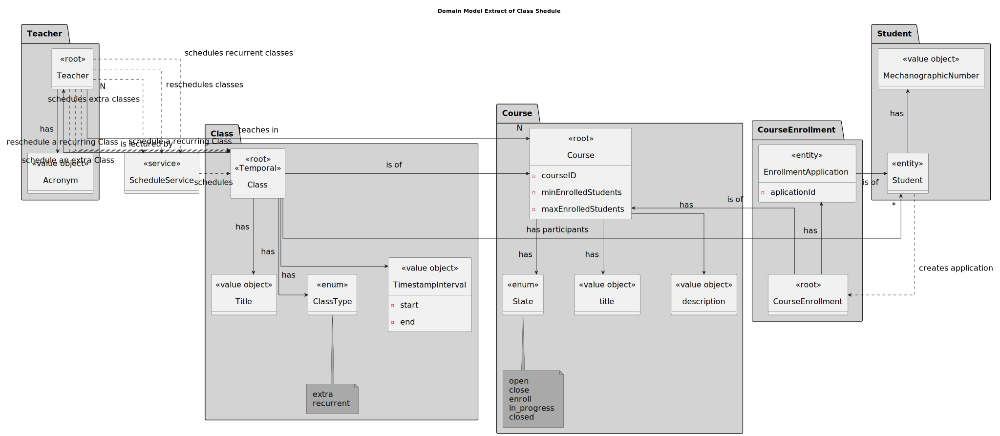
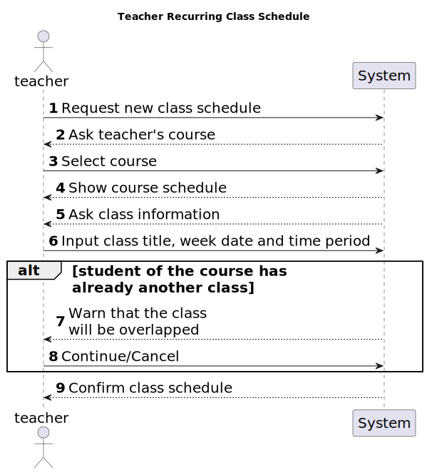
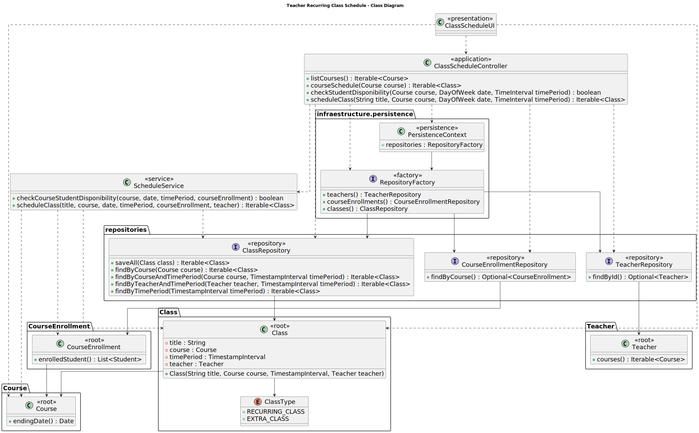

# US 1010

FRC09 - **As Teacher, I want to schedule a class**

## 1. Context

This is the first time this task is being developed.

## 2. Requirements

In this functionality, the teacher should be able to schedule a class (always a recurring class).
The system must check if the class is coincident with other classes of the same course, and if the teacher is available.
The system must also warn if one of the participants of a class (student or teacher) has other classes at the same time.
The class title should be unique.

**Regarding this requirement we understand that it relates to the following requirements:**

- [US 1002](../us_1002/readme.md) - As Manager, I want to create courses 

### 2.1. Additional Client Requirements


*   **Q**: When a teacher wants to schedule a class, do they introduce start date/time and end date/time,
or start date/time and duration of the class? And in general, how often will the client want to
consult the duration of the classes?

    **A**: For the class the teacher should entre the start date/time and duration (see Section 5.1.2).

    The duration of the class is important when scheduling "events" (such a classes and meetings) 
because the system must comply with some scheduling rules, for instance, to avoid scheduling
classes that are coincident with other classes of the same course (see Section 5.1.2).


*   **Q**: Nestas duas US, pretende que seja mostrada a lista de Class/ExtraClass que já estão agendadas 
para que o professor saiba onde pode agendar?

    **A**: Em termos de requisitos é importante que o sistema garanta as regras que estão descritas em 5.1.2 
relativo a aulas e aulas extra. Em termos de user interface para cada um desses casos de uso não existem
requisitos específicos.
Nesse aspeto de "user experience" devem seguir boas práticas. Mas isso já faz parte do desenho da solução.
"O cliente não percebe muito disso :-)"


*   **Q**: Should we allow the users to choose until what date they want to schedule the weekly classes or should
the weakly classes be scheduled until the end of the semester and if so what is the duration of the semester?

    **A**: I think there is no requirement that refers to the course duration or the concept of term or semester.
Therefore, if you do not consider the course to have a pre-established ending date, then you also
should not consider the end of the recurrence (in fact, it will happen when the manager closes the course).
If you consider that a course must have an ending date, then also consider the end of the recurrence of
he classes to the same date.

    However, since "nothing" happens at the time of the classes, the option you take will have limited 
implications, I think, only at the validation of availability of participants.

    
*   **Q**: Regarding weekly classes recurrence, should be considered as a recurrence class if it happens more
than one day per week? For example, the same class can occur on mondays and wednesdays?

    **A**: A class should be considered only one class ("aula"). This one class is always a recurring class.
If a course has more than one class each week, then each class will be a recurring class.

    

## 3. Analysis

*In this section, the team should report the study/analysis/comparison that was done in order to take the best design decisions for the requirement. This section should also include supporting diagrams/artifacts (such as domain model; use case diagrams, etc.),*

We understand that to the teacher be able to schedule a class in a course that he is teaching, first it needs to select the course.

After the teacher select the course, he should give the class name, the class recurring date, time and duration.

The system should check if the class is coincident with other classes of the same course, and if the teacher is available.

### 3.1. Domain Model Extract



### 3.1. System Sequence Diagram

## 4. Design

*In this sections, the team should present the solution design that was adopted to solve the requirement. This should include, at least, a diagram of the realization of the functionality (e.g., sequence diagram), a class diagram (presenting the classes that support the functionality), the identification and rational behind the applied design patterns and the specification of the main tests used to validade the functionality.*

### 4.1. Realization



### 4.2. Class Diagram



### 4.3. Applied Patterns

Considering the analysis and design of the previous sections, the team decided to apply the following patterns:
- **Factory Method** - to create the class instances
- **Dependency Injection** - to inject dependencies
- **Information Expert** - to assign the responsibility of creating the class to the class itself
- **Repository** - to store the classes
- **Pure Fabrication** - to assign the responsibility of checking the availability of the participants of a class to the service class
- **Service** - to check the availability of the participants of a class, and to create the class
- **Value Object** - to represent the class date and time period

### 4.4. Tests

For this requirement, here are the main tests that were implemented:

**Test 1:** *Ensure that the class time period is before the course close date*

```
    @Test(expected = IllegalArgumentException.class)
    public void ensureTimePeriodIsBeforeCourseCloseDate() {
        Calendar.Builder builderStart = new Calendar.Builder();
        builderStart.setDate(2023, 6, 1);
        builderStart.setTimeOfDay(10,0,0);
        Calendar beginDate = builderStart.build();
        Calendar.Builder builderEnd = new Calendar.Builder();
        builderEnd.setDate(2023, 6, 1);
        builderEnd.setTimeOfDay(12,0,0);
        Calendar endDate = builderEnd.build();
        TimestampInterval timePeriod = new TimestampInterval(beginDate, endDate);
        Class class1 = new Class(VALID_CLASS_TITLE, course, timePeriod, enrolledStudents, teacher, ClassType.RECURRING_CLASS);
    }
````

**Test 2:** *Ensure that there are enrolled students when creating the class*
```
    @Test(expected = IllegalArgumentException.class)
    public void ensureEnrolledStudentsAreNotEmpty() {
        Class class1 = new Class(VALID_CLASS_TITLE, course, timePeriod, new ArrayList<>(), teacher, ClassType.RECURRING_CLASS);
    }
```

**Test 3:** *Ensure that does not schedule the classes because classes already exist at that time* 

````
    @Test(expected = IllegalArgumentException.class)
        public void ensureNotScheduleClassWithClassesAlreadyExisting() {
            defaultTeacher();
            defaultCourse();
            defaultCourseEnrollment();
            defaultTimeInterval();
    
            ArrayList<Class> toRet = new ArrayList<>();
            toRet.add(Mockito.mock(Class.class));
            Mockito.when(classes.findByCourseAndTimePeriod(Mockito.any(Course.class), Mockito.any(TimestampInterval.class) )).thenReturn(toRet);
    
            Iterable<Class> ret = new ScheduleService(authz, classes).scheduleClass("Class Test", course , dayOfWeek, timeInterval, courseEnrollment, teacher);
        }
````

## 5. Implementation

Regarding the implementation of this requirement, probably the most relevant part of the is the implementation of the ScheduleService class, which is responsible for scheduling the classes.

````
public class ScheduleService {

[...]
    public boolean checkCourseStudentDisponibility(Course course, DayOfWeek date, TimeInterval timePeriod, CourseEnrollment courseEnrollment) {
        authz.ensureAuthenticatedUserHasAnyOf(ECourseRoles.STUDENT_USER);

        Preconditions.nonNull(course);
        Preconditions.nonNull(date);
        Preconditions.nonNull(timePeriod);
        Preconditions.nonNull(courseEnrollment);

        Date endingDate = course.closeDate();
        List<Student> enrolledStudents = courseEnrollment.enrolledStudents();

        // for each day of the week until endingDate
        for (Date d = nextDateOfDayOfWeek(new Date(), date); d.before(endingDate); d = DateUtils.addWeeks(d, 1)) {
            TimestampInterval interval = createTimestampInterval(d, timePeriod);
            Iterable<Class> classes = this.classes.findByTimePeriod(interval);

            // for each class on that day
            for (Class c : classes) {
                // for each student enrolled in the course
                for (Student s : enrolledStudents) {
                    // if the student is enrolled in the class
                    if (c.hasStudentEnrolled(s)) {
                        return false;
                    }
                }
            }

        }

        return true;
    }

    public Iterable<Class> scheduleClass(String title, Course course,
                                         DayOfWeek date, TimeInterval timePeriod,
                                         CourseEnrollment courseEnrollment,
                                         Teacher teacher) {
        List<Class> createdClasses = new ArrayList<>();
        List<Student> students = courseEnrollment.enrolledStudents();
        Date endingDate = course.closeDate();

        // for each day of the week until endingDate
        for (Date d = nextDateOfDayOfWeek(new Date(), date); d.before(endingDate); d = DateUtils.addWeeks(d, 1)) {
            TimestampInterval interval = createTimestampInterval(d, timePeriod);
            Iterable<Class> classes = this.classes.findByCourseAndTimePeriod(course, interval);
            if (classes.iterator().hasNext())
                throw new IllegalArgumentException("There are classes for the given course and time period");
            classes = this.classes.findByTeacherAndTimePeriod(teacher, interval);
            if (classes.iterator().hasNext())
                throw new IllegalArgumentException("The teacher is not available for the given time period");
        }

        // for each day of the week until endingDate
        for (Date d = nextDateOfDayOfWeek(new Date(), date); d.before(endingDate); d = DateUtils.addWeeks(d, 1)) {
            TimestampInterval interval = createTimestampInterval(d, timePeriod);
            Class c = new Class(title, course, interval, students, teacher, ClassType.RECURRING_CLASS);
            createdClasses.add(c);
        }

        return createdClasses;
    }
}

````

The major commits regarding this requirement are the following:

- [0186c575]
    - #18 [US 1010] #18.2 Added CD;
          - Small corrections on SD and sub SD's (added teacher to various methods)

- [2b06790a]
      - #18 [US1010] #18.2 Updated CD and SD's (small corrections)
      - #18.3 Added ScheduleService class;
      - Corrected primitive Student, ECourseUser and CourseEnrollment;
      - Added necessary methods to Class (hasStudentEnrolled()), ClassRepository (findByCourseAndTimePeriod(), findByTeacherAndTimePeriod(), findByTimePeriod());

## 6. Integration/Demonstration

*In this section the team should describe the efforts realized in order to integrate this functionality with the other parts/components of the system*

*It is also important to explain any scripts or instructions required to execute an demonstrate this functionality*

## 7. Observations

*This section should be used to include any content that does not fit any of the previous sections.*

*The team should present here, for instance, a critical prespective on the developed work including the analysis of alternative solutioons or related works*

*The team should include in this section statements/references regarding third party works that were used in the development this work.*
