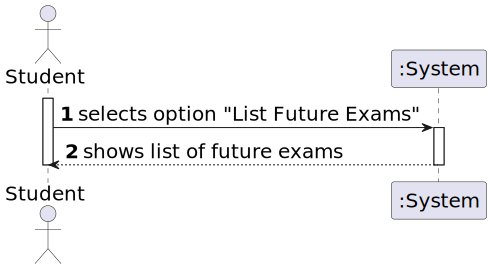
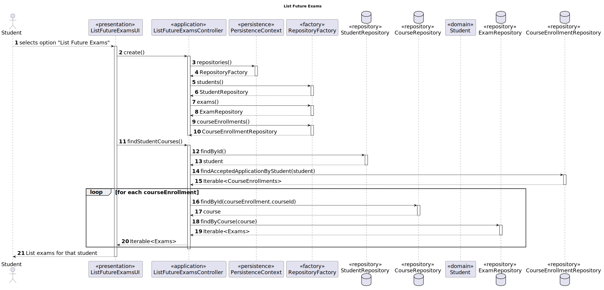
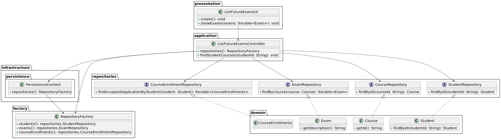

# US 2002

FRE02 - List Exams The system displays to a student his/her future exams

## 1. Context

*It is the first time the task is assigned to be developed.*

## 2. Requirements

**US 2002** As Student, I want to view a list of my future exams.

## 3. Analysis

### 3.1. Domain Model Extract

na

### 3.2. System Sequence Diagram



## 4. Design

### 4.1. Realization



### 4.2. Class Diagram



### 4.3. Applied Patterns

### 4.4. Tests

To be implemented.

## 5. Implementation

```
    @Override
    protected boolean doShow() {
        // find student
        // TODO: 29/10/2020
        // find student courses
        final Iterable<Course> studentEnrolledCourses = ctrl.findEnrolledCourses();

        // list future exams by course
        if (!studentEnrolledCourses.iterator().hasNext()) {
            System.out.println("There are no available Courses.");
        } else {
            final SelectWidget<Course> selector = new SelectWidget<>("Select one of the courses:",studentEnrolledCourses,new CoursePrinter());
            selector.show();
            Course course = selector.selectedElement();
            // list future exams by course
            ListWidget<Exam> futureExams = new ListWidget<>("Future Exams:",ctrl.listFutureExamsByCourse(course),new ExamPrinter());
            futureExams.show();
        }
        return true;
    }
```

## 6. Integration/Demonstration

## 7. Observations

*Incomplete solution due to lack of important method to retrieve the courses in which the student is enrolled.*