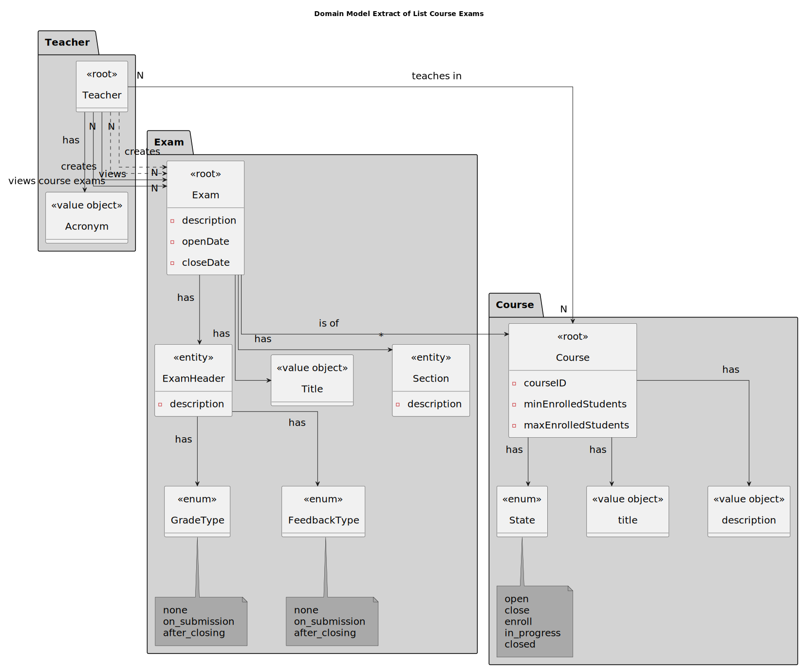
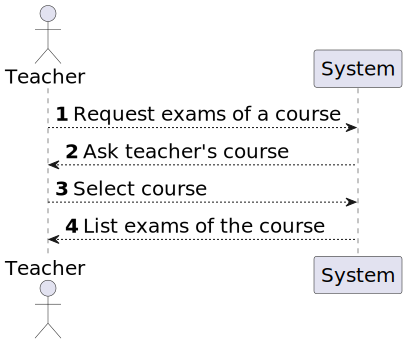
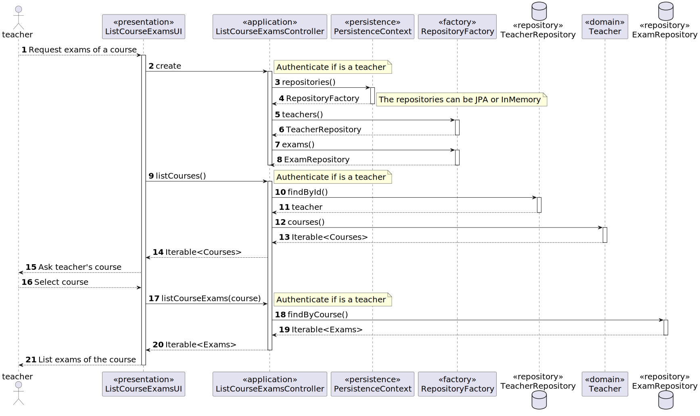
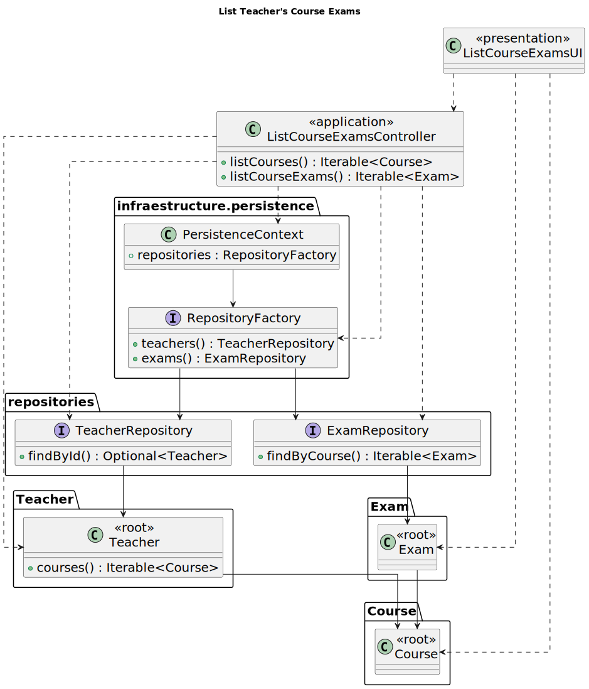

# US 2003

FRE03 - **As Teacher, I want to view a list of all exams in a course**

## 1. Context

This is the first time this task is being developed.

## 2. Requirements

In this funcionality, the teacher should be able to view a list of all exams in a course that he is teaching.

**Regarding this requirement we understand that it relates to the following requirements:**

- [US 2001](../us_2001/readme.md) - As Teacher, I want to create/update an exam
- [US 2008](../us_2008/readme.md) - As Teacher, I want to create/update automatic formative exams

## 3. Analysis

*In this section, the team should report the study/analysis/comparison that was done in order to take the best design decisions for the requirement. This section should also include supporting diagrams/artifacts (such as domain model; use case diagrams, etc.),*

We understand that to the teacher be able to view a list of all exams in a course that he is teaching, first it needs to select the course that he wants to see the exams.
After the teacher select the course, the system will show the list of all existing exams of that course.

### 3.1. Domain Model Extract



### 3.2. System Sequence Diagram



## 4. Design

*In this sections, the team should present the solution design that was adopted to solve the requirement. This should include, at least, a diagram of the realization of the functionality (e.g., sequence diagram), a class diagram (presenting the classes that support the functionality), the identification and rational behind the applied design patterns and the specification of the main tests used to validade the functionality.*

### 4.1. Realization

Authentication functionalities were implemented using the eapli.framework.infrastructure.authz framework.



### 4.2. Class Diagram



### 4.3. Applied Patterns

- **Factory Method:** The factory method pattern was used to create the Repositories. This pattern was used because it allows the creation of objects without exposing the creation logic (JPA or InMemory) to the client and refer to newly created objects using a common interface.
- **Repository:** The repository pattern was used to abstract the persistence layer. This pattern was used because it allows the creation of objects without exposing the creation logic (JPA or InMemory) to the client and refer to newly created objects using a common interface.

### 4.4. Tests

**Test 1:** *Verifies that it is not possible to create an instance of the Example class with null values.*

```
@Test(expected = IllegalArgumentException.class)
public void ensureNullIsNotAllowed() {
	Example instance = new Example(null, null);
}
````

## 5. Implementation

The major code developed to implement was the implementation of ClassRepository.findByCourse() on JPA and InMemory :

````
public class JpaClassRepositoryImpl ... {

    [...]
  
    @Override
    public Iterable<Exam> findByCourse(Course course){
        String string = course.identity();
        Query query = entityManager().createQuery("select s from Exam s where s.course.courseId= :courseId");
        query.setParameter("courseId", string);
        return (Iterable<Exam>) query.getResultList();
    }
}
````

Regarding the implementation of this requirement, the major commits are:

- [cd74bdee]
    - #23 Corrected domain classes;
    - Added some tests
- [e1500812]
  - #23 Added domain classes

## 6. Integration/Demonstration

*In this section the team should describe the efforts realized in order to integrate this functionality with the other parts/components of the system*

*It is also important to explain any scripts or instructions required to execute an demonstrate this functionality*

## 7. Observations

*This section should be used to include any content that does not fit any of the previous sections.*

*The team should present here, for instance, a critical prespective on the developed work including the analysis of alternative solutioons or related works*

*The team should include in this section statements/references regarding third party works that were used in the development this work.*