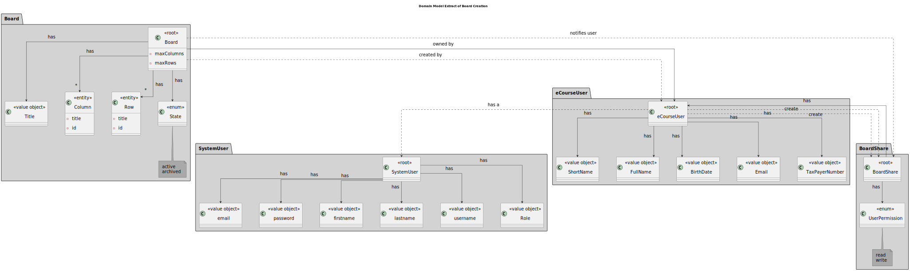
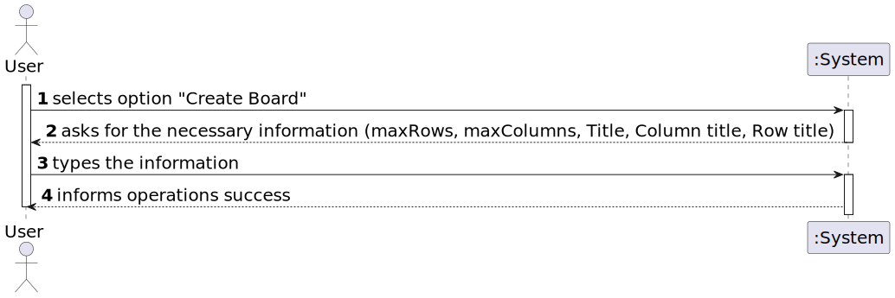
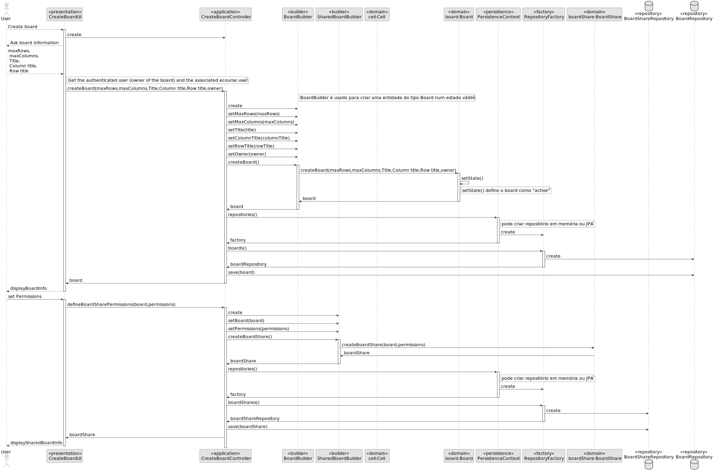
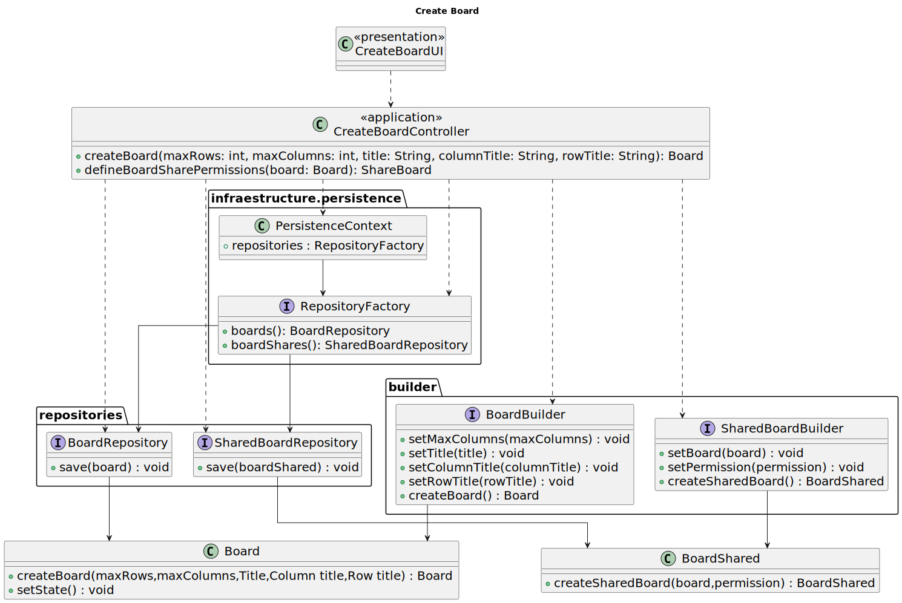

# US 3002

**As User, I want to create a board**

## 1. Context

*This task is to be completed in this sprint. It is the first time the task is assigned to be developed.*

## 2. Requirements
**US 3002** As User, I want to create a board
- FRB01. Create Board

## 2.1 Acceptance Criteria/Comments
* n/a
## 3. Analysis

*This functionality can bue executed by both students and teachers*
3.1 Domain Model Extract

## 4. Design
### 4.1. Realization

### 4.1.1. Sequence Diagram

### 4.2.Class Diagram

### 4.3. Applied Patterns

Considering the analysis and design of the previous sections, the team decided to apply the following patterns:
- **Factory Method** - to create the class instances
- **Information Expert** - to assign the responsibility of creating the class to the class itself
- **Repository** - to store the classes
- **Pure Fabrication** - to assign the responsibility of checking the availability of the participants of a class to the service class
- **Service** - to check the availability of the participants of a class, and to create the class
- **Value Object** - to represent the class date and time period
### 4.4. Tests

*NA*

## 5. Implementation

## 6. Integration/Demonstration
* It is needed to be logged as a teacher or student to be able to execute this operation.

## 7. Observations
* This task could not be completed in this sprint. It will be completed in the next sprint.

