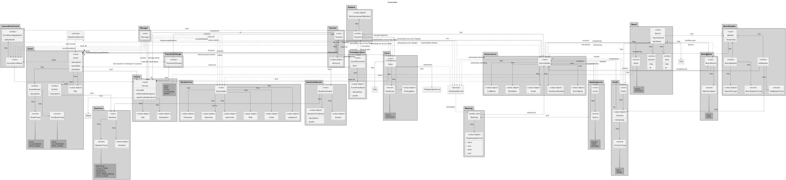

# Sprint C

## 1. Sprint Master

[1211739 - Délcio Monjane](../1211739/readme.md)

## 2. Sprint Planning

### 2.1 User Stories's Estimation

| GitHub Issue ID | US ID | Description                                                             | Estimation (t-shirt sizing) |
|-----------------|-------|-------------------------------------------------------------------------|-----------------------------|
| #34             | 3004  | As User, I want to share a board                                        | L                           |
| #35             | 3005  | As User, I want to view, in real-time, the updates in the shared boards | XL                          |
| #36             | 3006  | As User, I want to create a post-it on a board                          | L                           |
| #37             | 3007  | As User, I want to change a post-it                                     | M                           |
| #38             | 3008  | As User, I want to undo the last change in a post-it                    | L                           |
| #39             | 3009  | As User, I want to view the history of updates on a board               | XL                          |
| #41             | 2004  | As Student, I want to take an exam                                      | XL                          |
| #42             | 2005  | As Student, I want to view a list of my grades                          | S                           |
| #43             | 2006  | As Teacher, I want to view a list of the grades of exams of my courses  | M                           |
| #44             | 2009  | As Student, I want to take an automatic formative exam                  | XL                          |

### 2.2 Task Assignment

The assignment of tasks (requirements/user stories/use cases) during the project.

| Student Nr.                     | Sprint C                                                                                                                           |
|---------------------------------|------------------------------------------------------------------------------------------------------------------------------------|
| [1211345](../1211345/readme.md) | [US 3005](./us_3005), [US 3008](./us_3008), [US 3010](./us_3010), [US 2004](./us_2004), [US 2009](./us_2009)                       |
| [1211359](../1211359/readme.md) | [US 3004](./us_3004), [US 3005](./us_3005), [US 3009](./us_3009)                                                                   |
| [1210814](../1210814/readme.md) | [US 3005](./us_3005), [US 3007](./us_3007), [US 2004](./us_2004), [US 2005](./us_2005), [US 2006](./us_2006), [US 2009](./us_2009) |
| [1211739](../1211739/readme.md) | [US 3005](./us_3005), [US 3006](./us_3006), [US 3009](./us_3009)                                                                   |
| [1200616](../1200616/readme.md) | [US 2004](./us_2004), [US 2009](./us_2009)                                                                                         |

## 3. Administrative Tasks ##

### 3.1. Team Meetings ###

| Date       | Meeting Type         | Meeting Location | Meeting Summary                                                                                                                                                            |
|------------|----------------------|------------------|----------------------------------------------------------------------------------------------------------------------------------------------------------------------------|
| 2023-05-22 | Sprint Review        | Online           | Sprint Review                                                                                                                                                              |
| 2023-05-22 | Sprint Retrospective | Online           | Sprint Retrospective                                                                                                                                                       |
| 2023-05-24 | Sprint Planning      | ISEP             | Sprint Planning                                                                                                                                                            |
| 2023-05-25 | Daily Scrum          | ISEP             | Sprint C inital documentation                                                                                                                                              |
| 2023-05-26 | Daily Scrum          | ISEP             | Work status. Preliminary Implementation                                                                                                                                    |
| 2023-05-29 | Daily Scrum          | ISEP             | Work status. Implementation                                                                                                                                                | 
| 2023-06-03 | Daily Scrum          | ISEP             | Work status. Implementation                                                                                                                                                |
| 2023-06-04 | Daily Scrum          | ISEP             | Work status. Implementation                                                                                                                                                |
| 2023-06-05 | Daily Scrum          | ISEP             | Work status. Implementation                                                                                                                                                |
| 2023-06-06 | Daily Scrum          | Online           | Remote database set up and testing.                                                                                                                                        |
| 2023-06-07 | Daily Scrum          | Online           | Preparing HTML and Server for Board viewing.                                                                                                                               |
| 2023-06-08 | Daily Scrum          | Online           | Server corrections. Exam taking implementation.                                                                                                                            |
| 2023-06-09 | Daily Scrum          | ISEP             | Exam Taking Corrections. Further planning related to server implementation.                                                                                                |
| 2023-06-12 | Daily Scrum          | ISEP             | HTTP Server Correction. Further corrections on exam taking.                                                                                                                |
| 2023-06-13 | Daily Scrum          | ISEP             | HTTP Server Correction. Migration of direct acces to database to communication via TCP                                                                                     |
| 2023-06-13 | Discussion Meeeting  | Online           | Discussion about synchronization issues related to the shared boards and how to solve them.                                                                                |
| 2023-06-15 | Daily Scrum          | ISEP             | TCP Server Corrections. Added Events to generate Updates when the board is changed. Added session ID to prevent unauthorized access. Added postIt related functionalities. |
| 2023-06-16 | Daily Scrum          | ISEP             | HTML corrections. TCP Server Corrections. Fixed Large Image Issue. Documentation update.                                                                                   |
| 2023-06-17 | Daily Scrum          | Online           | HTML corrections.Fixed Large Image Issue. Documentation update.                                                                                                            |
| 2023-06-18 | Daily Scrum          | Online           | Documentation Update. Project Revision                                                                                                                                     |                                                                                                                                     |

## 4. Common Changes ##

### 4.1. Domain Model ###

In this sprint, the domain model was updated. The main changes were:

 - The aggregate "Cell" was renamed to "PostIt" to better represent the domain.
 - The PostIt "Content" value object is now the "Content" used in the Update aggregate.
 - Was added an "undo" state to the Update aggregate root.

## 5.Team Decision ##
- The team decided to address the synchronization issues related to the shared boards by implementing a synchronization object, a singleton class used by all threads in TCP server that is responsible for the synchronization of the operations on the shared boards.
- The team evaluated the scenarios that could be problematic and protected the code with locks to prevent the occurrence of those scenarios.
- Upon the problem of multiple-user access to the TCP server, through the HTTP server, the team decided to implement a session ID to prevent unauthorized access to the server and to control them.