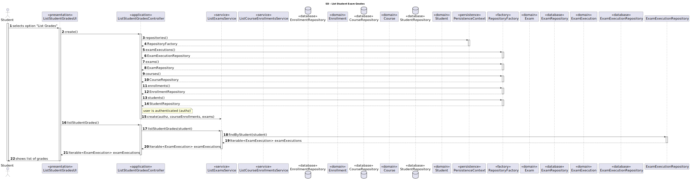

# US 2005

• FRE05 - List Grades The system displays to a students his/her grades

## 1. Context

*It is the first time the task is assigned to be developed.*

## 2. Requirements

**US 2005** As Student, I want to view a list of my grades.

**Regarding this requirement we understand that it relates to the following requirements:**

- [US 2009](../us_2009/readme.md) - As Student, I want to take an automatic formative exam

## 3. Analysis

We understand that to view the grades of a student, the student needs to be logged in;
It also needs to have executed exams;

### 3.1. Requirements Realization


## 4. Design

### 4.1. Realization



### 4.2. Class Diagram


### 4.3. Applied Patterns

Considering the analysis and design of the previous sections, the team decided to apply the following patterns:
- **Factory Method** - to create the repositories
- **Information Expert** - the exam execution is responsible for the grades of the exams
- **Repository** - to access the data
- **Service** - to implement the business logic in a centralized way to view the grades of a student

### 4.4. Tests

#### 4.4.1. calculateGrade

````
        public void calculateGrade() {
        Assert.assertEquals(10F, examExecution1.calculateGrade(), 0.01);
        Assert.assertNotEquals(5F, examExecution1.calculateGrade(), 0.01);
    }
````

## 5. Implementation

### 5.1. ListStudentGradesUI

```
    protected boolean doShow() {
        ListWidget<ExamExecution> listStudentGrades = new ListWidget<>("Student Grades", controller.listStudentGrades());
        listStudentGrades.show();
        return true;
    }
````

### 5.2 Major Commits

- Preliminary version of US2005 SD - 35831b7
- Preliminary and functional implementation of functionality for students to list their grades - 07672df

## 6. Integration/Demonstration

*To execute this functionality the student needs to be logged in and have executed exams.*
*They will be presented with a list of their grades.*

## 7. Observations

na.