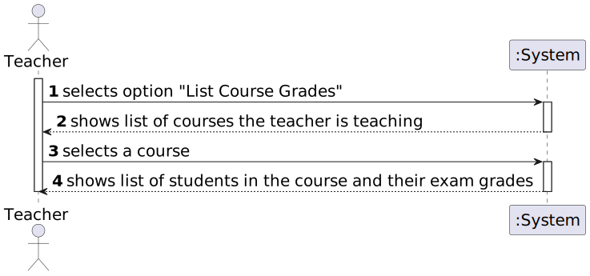
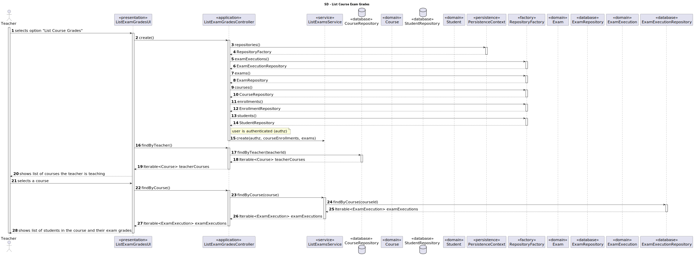
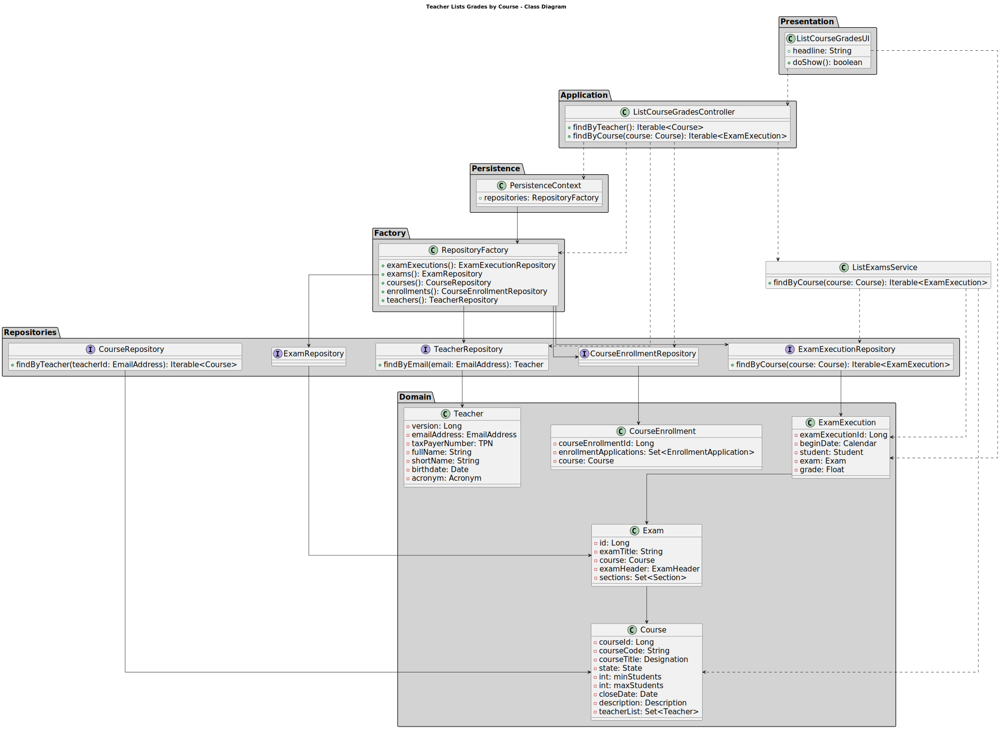

# US 2006

• FRE06 - List Course Grades The system displays the grades of a class (to a teacher of that course)

## 1. Context

*It is the first time the task is assigned to be developed.*

## 2. Requirements

**US 2006** As Teacher, I want to view a list of the grades of exams of my courses.

**Regarding this requirement we understand that it relates to the following requirements:**

- [US 1005](../../sprintB/us_1005/readme.md) - As Manager, I want to set the teachers of a course
- [US 2009](../us_2009/readme.md) - As Student, I want to take an automatic formative exam

## 3. Analysis

We understand that to view the grades of exams of teacher courses, the teacher needs to be logged in;
It also needs to have a course assigned to the teacher;
There need to be exams created for the course and the exams need to be graded;

### 3.1. Requirements Realization



## 4. Design

### 4.1. Realization



### 4.2. Class Diagram



### 4.3. Applied Patterns

Considering the analysis and design of the previous sections, the team decided to apply the following patterns:
- **Factory Method** - to create the repositories
- **Information Expert** - the exam execution is responsible for the grades of the exams
- **Repository** - to access the data
- **Service** - to implement the business logic in a centralized way to view the grades of exams of teacher courses

### 4.4. Tests

#### 4.4.1. calculateGrade

````
        public void calculateGrade() {
        Assert.assertEquals(10F, examExecution1.calculateGrade(), 0.01);
        Assert.assertNotEquals(5F, examExecution1.calculateGrade(), 0.01);
    }
````

## 5. Implementation

### 5.1. ListExamGradesByCourseUI

```
    protected boolean doShow() {
        //list teacher courses
        final Iterable<Course> courses = controller.findByTeacher();
        if (!courses.iterator().hasNext()) {
            System.out.println("Teacher is not assigned to any course.");
        } else {
            try {
                final SelectWidget<Course> selector = new SelectWidget<>("Select one of the courses:", courses);
                selector.show();
                Course course = selector.selectedElement();
                if (course != null) {
                    // list course grades
                    ListWidget<ExamExecution> listCourseGrades = new ListWidget<>("Course Grades", controller.findByCourse(course));
                    listCourseGrades.show();
                }
            }catch (Exception ex) {
                LOGGER.error("Error performing the operation", ex);
            }
        }
        return true;
    }
````

### 5.2 Major Commits

 - Preliminary version of US2006 SD - 35831b7
 - Preliminary and functional implementation of functionality for teachers to list the exam grades in their courses - 0981f66

## 6. Integration/Demonstration

*To execute this functionality, you need to login as a teacher and select the option "List Grades Of Exams Of Teacher Courses"*
*Then you will be presented with a list of courses you teach and you can select one of them to see the grades of the exams of that course.*

## 7. Observations

na.