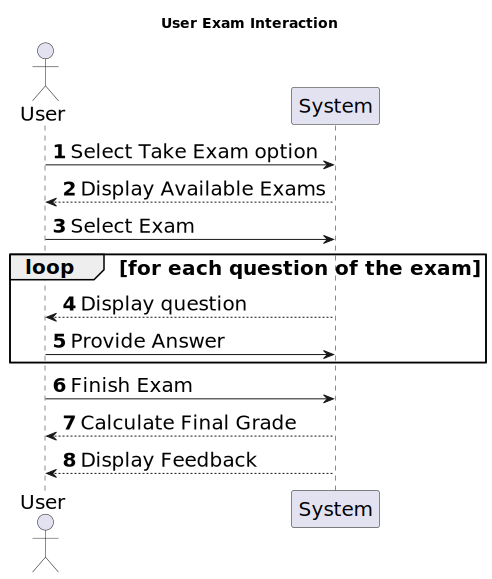
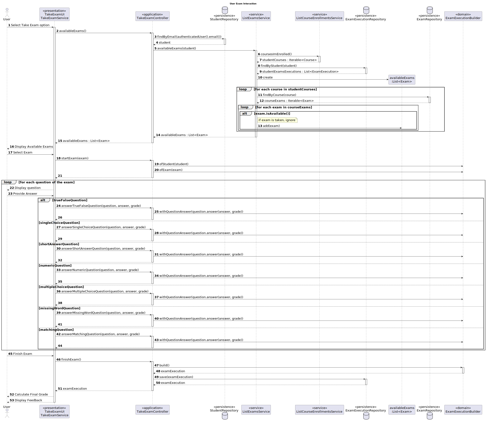
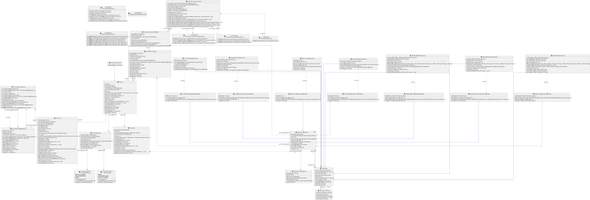

# US 2009

As Student, I want to take an automatic formative exam

## 1. Context

GitHub issue: #44

## 2. Requirements

A Student takes an automatic formative exam and answer its questions. Each time the system generates a new exam based on the database of questions and the specification of that exam.
At the end of the exam, the system should display the feedback and result (i.e., grade) of the exam.
The feedback and grade of the exam should be automatically calculated by a parser based on the grammar defined for exams structure.

*Regarding this requirement we understand that it relates to...*
 - [US 2008](../../sprintB/us_2008/readme.md) - As Teacher, I want to create/update automatic formative exams
 - [US 2007](../../sprintB/us_2007/readme.md) - As Teacher I want to add/update exam questions to a repository of exam questions to be used in automatic formative exams

## 2.1. Additional Client Requirements

> **Q:** Relativamente à funcionalidade de realizar um exame, mais concretamente à parte de mostrar a nota/feedback com a propriedade "after-closing" (referenciado na especificação do sistema), é esperado o aluno ser notificado mal a data de fecho do exame seja atingida ou pretende-se apenas que a nota possa ser visualizada a partir da funcionalidade correspondente à US2005/2006.
> Caso pretenda que o aluno seja notificado, pergunto-lhe se isto deve ser feito através de uma notificação do sistema ou através de um serviço, por exemplo, email.
> 
> **A:** Não consigo encontrar nenhuma referência a uma notificação depois da data de fecho do exame. O que vejo é que o sistema deve mostrar o resultado e o feedback no final do exame.
> A questão que se pode colocar é quando é que acontece o "fim do exame". Podemos entender que é quando o aluno submete o seu exame ou quando atingimos a data de fecho do exame ("close date"). Como cliente posso indicar que aceito a primeira interpretação, ou seja, assim que o aluno submete o seu exame, este recebe o feedback e nota (de forma sincrona). Penso que em termos de solução será a situação mais simples.
> 
> **Q:** Tendo em conta que aceita primeira interpretação, qual será a diferença entre on-submission e after-closing? A minha dúvida é principalmente acerca do funcionamento da propriedade after-closing.
> 
> **A:** A minha indicação anterior é a de que o aluno recebe o feedback e a nota quando submete o exame. Em principio o aluno tem de submeter o exame antes do tempo de fecho do exame. Se o aluno tentar submeter um exame depois do seu fecho o sistema deve simplesmente não aceitar a entrega/submissão.

> **Q:** A propósito das US's 2004 e 2009, de que forma é que os exames serão apresentados ao aluno para o mesmo os realizar? Será semelhante às boards, em que será criada uma página em Java Script? 
> 
> **A:** Apenas a aplicação "shared board app" implementa um servidor http para servir o "board viewer". Todas as outras funcionalidades da solução devem estar distribuídas pelas outras "apps", que devem ser java console applications. Ou seja, a "user interface" para a funcionalidade dos exames deve ser implementada como uma console application. A referencia aos "quiz" do moodle é apenas para ilustrar quais as funcionalidades pretendidas. Mas a sua implementação não necessita de ser realizada em HTML (ou seja, não é esperado que o façam).

> **Q:** When a student takes an exam, should we assume that he has only one attempt, or the number of attempts should be specified in the exam grammar?
> 
> **A:** There is no mention regarding attempts in the specification, therefore there is no need to support that functionality.

> **Q:** Em relação a esta us e aos esclarecimentos que foram dados anteriormente gostariamos de esclarecer algumas questoes:
> 1 - Ao atualizar um exame é necessario calcular de novo a nota do aluno ou continua com a sua nota antiga?(Se for necessario entao teremos de persistir as respostas do aluno)
> 2 - Em relação ás perguntas 'short answer' estas podem ser corrigidas automaticamente?(o utilizador teria 100% da cotação se a resposta fosse igual e 0% caso seja diferente)
> 
> **A:** Embora possa não estar explicito na especificação, não faz sentido fazer alterações a exames depois da "open date" ou de haver já exames respondidos.
> Quanto às perguntas, todas elas (i.e., todos os tipos de perguntas) devem ser passíveis de correção automática. É esse o objectivo.

> _when a student finished taking exam, will he want at some point review the exam and see his answers?_
> **This is not required.**
>
> _Do we need to save the exam with the answers of a certain student to be able to show it later (if needed), or should we just calculate the final grade and show feedback for each question (if applicable)?_
> **Just calculate the final grade and show feedback for each question. Unless saving of the answers is required as a technical solution for some other aspect of your solution you do not need to save the answers.**
>
> _Another question is about types of feedback: on-submission means on submission of a question or the whole exam?_
> **On submission of the whole exam.**

> **Q:** After discussing these questions with the OT teacher, we would like to know your opinion about the grades.
> First we would like to know if you wish that the grades are saved in the program database. Second we would like for you to clarify the expected flow of both feedback and grade types.
> 
> **A:** Regarding the first question, if you do not save the grades how do you implement the functionalities of FRE05 and FRE06?
> Regarding the second question, the ideia is to have something very similar to the Moodle platform. According to the specification "The system must also support the automatic production of feedback and grading for the answers given by students when they take the exam. Usually this is done at the end of the exam." So, the grade and the feedback should be provided only and the end of the exam. At the end of the exam, the system should display to the student the resulting grade of the exam as well as the grade and feedback for each question/answer.
> You may find a simple workflow on how to create moodle tests(quiz) in https://youtu.be/dCDPS7ufGuQ
> Regarding grades, each question will have points when the answer is correct. If you sum all the points form all the answers you will have the grade of the exam.
> Please consider only the question types that are presented in the specification document. For each question type you will find further details on the specifics of the grading logic.

## 3. Analysis

Regarding the analysis of the requirements, we understood that the system should display the questions of the exam to the student and record the answer of it. 
The system should also provide automatic feedback and grading for the answers given by the student, by comparing with the solution of the exam.  
This funcionality is exactly the same as the [US 2004 - As Student, I want to take an Exam](../us_2004/readme.md),
because the formative exam is already created and recored in the database. The only main difference is that the formative exam
does not have a due date, so the student can take the exam whenever he wants.

## 4. Design

Like the [US 2004 - As Student, I want to take an Exam](../us_2004/readme.md), the design of this US is exactly the same,
so we incorporated this funcionality in the normal one, the only difference is that is always displayed to the student
in the UI (if it is not already answered), and the student can take the exam whenever he wants.

Because the team implemented the Listener in the creation of the exam itself, the team decided only to create the necessary domain classes and methods.

### 4.1. Realization

### 4.1.1. System Sequence Diagram



### 4.1.2. Sequence Diagram



### 4.2. Class Diagram



### 4.3. Tests

The most relevant tests to this US are the tests to the Question.answer()
implementation methods of the different question types.
These tests are implemented in the respective test classes of each question type.
Here are some examples of these tests:

**Test 1:** *Verifies if the right grade is given to the respective answer of the short answer question.*

```

    @Test
    public void ensurePhrasesWithWildcardsAreCorrectlyMatched() {
        ShortAnswerQuestion question = setup();

        ShortAnswerQuestionAnswer answer = question.answer("Test", DEFAULT_GRADE);
        QuestionFeedback feedback = answer.feedback();
        assertEquals(DEFAULT_GRADE, feedback.grade(), 0.00);

        answer = question.answer("Test hello", DEFAULT_GRADE);
        feedback = answer.feedback();
        assertEquals(DEFAULT_GRADE, feedback.grade(), 0.00);

        answer = question.answer("To", DEFAULT_GRADE);
        feedback = answer.feedback();
        assertEquals(DEFAULT_GRADE/2, feedback.grade(), 0.00);

        answer = question.answer("Tes", DEFAULT_GRADE);
        feedback = answer.feedback();
        assertEquals(DEFAULT_GRADE/2, feedback.grade(), 0.00);
    }

````

**Test 2:** *Verifies if the right grade is given to the respective answer of the numerical choice question.*

    @Test
    public void ensureAnswerWithAcceptedSolutionIsCorrect() {
        NumericalQuestion question = setup();

        NumericalQuestionAnswer answer = question.answer(DEFAULT_SOLUTION + DEFAULT_ACCEPTANCE_ERROR, DEFAULT_GRADE);

        QuestionFeedback feedback = answer.feedback();
        assertEquals(DEFAULT_GRADE, feedback.grade(), 0.0);

        answer = question.answer(DEFAULT_SOLUTION - DEFAULT_ACCEPTANCE_ERROR, DEFAULT_GRADE);
        feedback = answer.feedback();
        assertEquals(DEFAULT_GRADE, feedback.grade(), 0.0);
    }


## 5. Implementation

To demonstrate that the implementation is according to the design, we present the following evidences:

* **ListExamsService.availableExams()**

````
    public List<Exam> availableExams(Student student) {
        Iterable<Course> studentCourses = new ListCourseEnrollmentsService(authz, courseEnrollments).coursesImEnrolled();

        List<Exam> studentExams = new LinkedList<>();
        List<ExamExecution> studentExamExecutions = (List<ExamExecution>) examExectutions.findByStudent(student);
        for (Course course : studentCourses) {
            for (Exam exam : exams.findByCourse(course)) {
                if (exam.isAvaliable()) {
                    boolean alreadyTookExam = false;
                    for (ExamExecution examExecution : studentExamExecutions) {
                        if (examExecution.exam().equals(exam)) {
                            alreadyTookExam = true;
                            break;
                        }
                    }
                    if (!alreadyTookExam) {
                        studentExams.add(exam);
                    }
                }
            }
        }
        return new ArrayList<>(studentExams);
    }
````

* **TakeExamController**

````
    public void answerTrueFalseQuestion(TrueOrFalseQuestion tfQuestion, boolean answer, float grade) {
        authz.ensureAuthenticatedUserHasAnyOf(ECourseRoles.STUDENT_USER);
        builder.withQuestionAnswer(tfQuestion.answer(answer,grade));
    }

    public void answerSingleChoiceQuestion(SingleChoiceQuestion scQuestion, String answer, float grade) {
        authz.ensureAuthenticatedUserHasAnyOf(ECourseRoles.STUDENT_USER);
        builder.withQuestionAnswer(scQuestion.answer(answer,grade));
    }

    public void answerShortAnswerQuestion(ShortAnswerQuestion saQuestion, String answer, float grade) {
        authz.ensureAuthenticatedUserHasAnyOf(ECourseRoles.STUDENT_USER);
        builder.withQuestionAnswer(saQuestion.answer(answer,grade));
    }

    public void answerNumericQuestion(NumericalQuestion nQuestion, int answer, float grade) {
        authz.ensureAuthenticatedUserHasAnyOf(ECourseRoles.STUDENT_USER);
        builder.withQuestionAnswer(nQuestion.answer(answer,grade));
    }

    public void answerMultipleChoiceQuestion(MultipleChoiceQuestion mcQuestion, Set<String> answer, float grade) {
        authz.ensureAuthenticatedUserHasAnyOf(ECourseRoles.STUDENT_USER);
        builder.withQuestionAnswer(mcQuestion.answer(answer,grade));
    }

    public void answerMissingWordQuestion(MissingWordQuestion mQuestion, Map<String, String> answers, float grade) {
        authz.ensureAuthenticatedUserHasAnyOf(ECourseRoles.STUDENT_USER);
        builder.withQuestionAnswer(mQuestion.answer(answers,grade));
    }

    public void answerMatchingQuestion(MatchingQuestion mQuestion, Map<String, Integer> answer, float grade) {
        authz.ensureAuthenticatedUserHasAnyOf(ECourseRoles.STUDENT_USER);
        builder.withQuestionAnswer(mQuestion.answer(answer, grade));
    }
````
The major commits regarding this requirement are:

 - **[02947ba]** #41 #44 Added methods to take questions ShortAnswerQuestion, SingleChoiceQuestion and TrueOrFalseQuestion in service TakeExamService.
 - **[3e8e899]** #44 #41 Added preliminary classes and persistence for ExamExecutions and corrected dependencies with QuestionAnswer.

## 6. Integration/Demonstration

*In this section the team should describe the efforts realized in order to integrate this functionality with the other parts/components of the system*

*It is also important to explain any scripts or instructions required to execute an demonstrate this functionality*

## 7. Observations

*This section should be used to include any content that does not fit any of the previous sections.*

*The team should present here, for instance, a critical prespective on the developed work including the analysis of alternative solutioons or related works*

*The team should include in this section statements/references regarding third party works that were used in the development this work.*