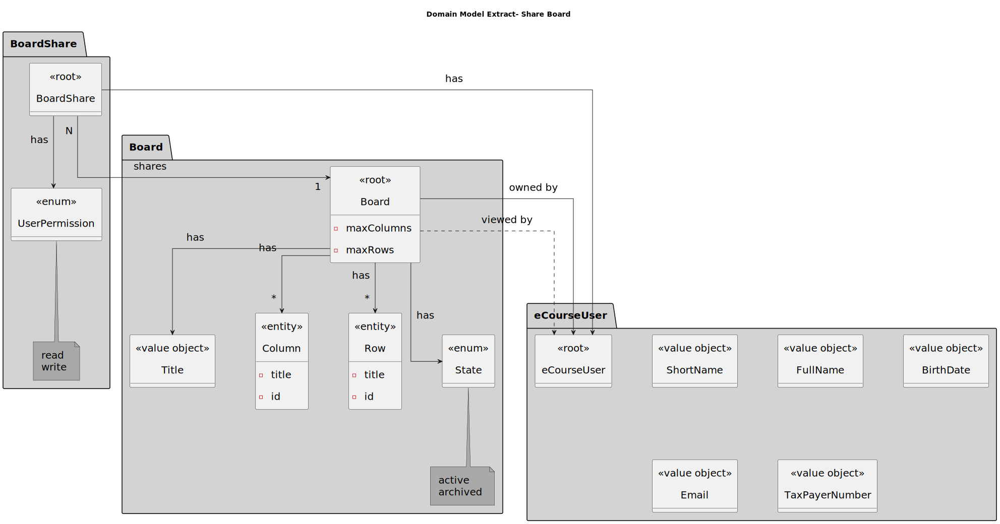
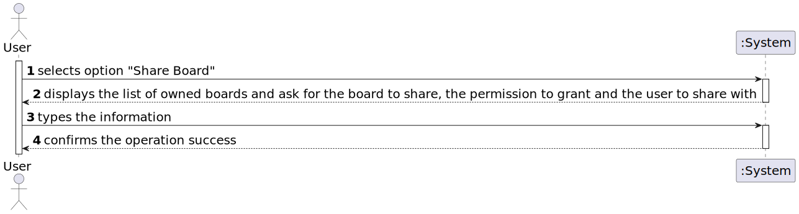
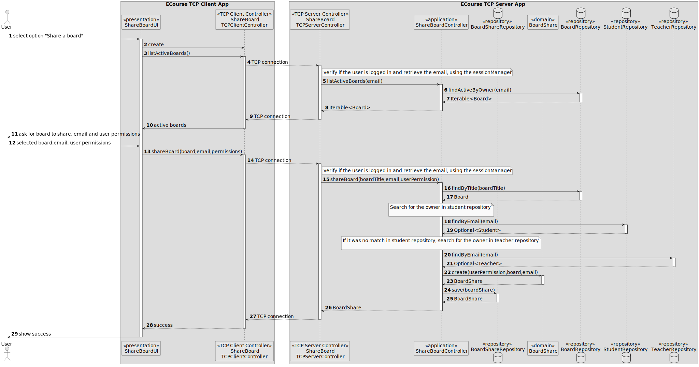
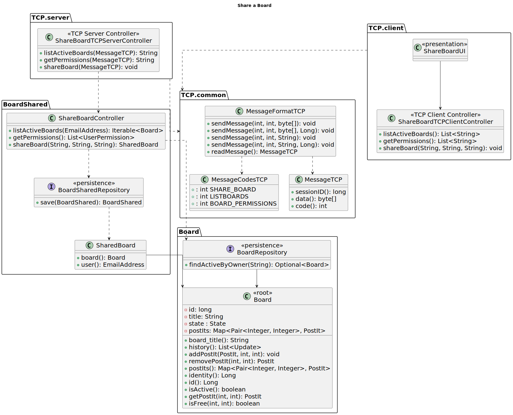

# US 3004

*As a User, I want to share a board*

## 1. Context

*This is the first time that is issue will be addressed, since it was only introduced in Sprint C.*

## 2. Requirements
*The requirement is related to US3002 - "As a User, I want to create a board", since the user can only share a board that he owns.*

**US 3004** As an User, I Want to share a board.

- FRB02 - Share Board A user shares a board it owns with other users

- NFR13 - Design and Implement Shared Board Synchronization This functional
  part of the system has very specific technical requirements, particularly some concerns
  about synchronization problems. In fact, several clients will try to concurrently update
  boards. As such, the solution design and implementation must be based on threads,
  condition variables and mutexes. Specific requirements will be provided in SCOMP.

*Regarding this requirement we understand that it relates to sharing an already existing board that a given user owns, allowing the attribution of reading or writing permissions*

## 3. Analysis
*The system should allow the user to share a board that he owns with other users*
*The system should allow the user to attribute reading or writing permissions to the users that he shares the board with*


## 4. Design

*In this sections, the team should present the solution design that was adopted to solve the requirement. This should include, at least, a diagram of the realization of the functionality (e.g., sequence diagram), a class diagram (presenting the classes that support the functionality), the identification and rational behind the applied design patterns and the specification of the main tests used to validade the functionality.*

### 4.1. Realization


### 4.2. Class Diagram



### 4.3. Applied Patterns
Considering the analysis and design of the previous sections, the team decided to apply the following patterns:
- **Repository** - to store the boards
- **Information Expert** - to assign the responsibility of creating the boardShare to the class itself
- **Factory Method** - to create the repositories
- **Singleton** - to ensure that only one Session Manager is created and to ensure object synchronization
### 4.4. Tests

**Test 1:** *Verifies that it is not possible to create an instance of the SharedBoard class with null permissions.*

```
@Test
    public void ensureSharedBoardIsNotCreatedWithInvalidUserPermission(){
        Assert.assertThrows(IllegalArgumentException.class,()-> new SharedBoard(null,board,email1));
    }
````

**Test 2:** *Verifies that the shared board is built valid.*

```
 @Test
    public void ensureBuildValid(){
        SharedBoard sh=new SharedBoard(userPermission,board,email1);
        Assert.assertNotNull(sh);
    }
}
````

**Test 3:** *Verifies that it is not possible to create an instance of the SharedBoard class with null board.*

```
@Test
    public void ensureSharedBoardIsNotCreatedWithInvalidBoard(){
        Assert.assertThrows(IllegalArgumentException.class,()-> new SharedBoard(userPermission,null,email1));
    }
````

## 5. Implementation
Regarding the implementation of this requirement, probably the most relevant part of the is the implementation of the method that allows the user to list his owned boards and the one to share a board that he owns with other users.
```

````
public class ShareBoardController {

[...]
    public SharedBoard shareBoard(String boardTitle, String sEmail, String sPermission) {

        EmailAddress email = EmailAddress.valueOf(sEmail);
        Board board = repositoryFactory.board().findByTitle(boardTitle).orElseThrow();
        UserPermission permission = UserPermission.valueOf(sPermission);
        StudentRepository repositoryStd = repositoryFactory.students();
        Optional<Student> student = repositoryStd.findByEmail(sEmail);
        if (!student.isPresent()) {
            TeacherRepository repositoryTch = repositoryFactory.teachers();
            Optional<Teacher> teacher = repositoryTch.findByEmail(email);
            if (!teacher.isPresent()) {
                throw new IllegalStateException("User does not exist");
            }
        }
        SharedBoard sharedBoard = new SharedBoard(permission, board, email);
        BoardSharedRepository repository = repositoryFactory.boardShared();
        repository.save(sharedBoard);
        return sharedBoard;
    }
    public Iterable<Board> listActiveBoards() {
        SystemUser user = authz.session().get().authenticatedUser(); //get authenticated user
        BoardRepository repo = repositoryFactory.boards();
        ownedBoards = repo.findActiveByOwner(user.email());
        if (!ownedBoards.iterator().hasNext()) {
            throw new IllegalStateException("User has no boards associated");
        }
        return ownedBoards;
    }

[...]

}
## 5.2 Major Commits
* Preliminary Sequence Diagram - f5b116d
* Unit Test - 77ee226
* Implementation - 16dbb2b
* Migration to TCP - 681ca37
* Updated Documentation - d4ce287


## 6. Integration/Demonstration

*In this section the team should describe the efforts realized in order to integrate this functionality with the other parts/components of the system*

*It is also important to explain any scripts or instructions required to execute an demonstrate this functionality*

## 7. Observations
na