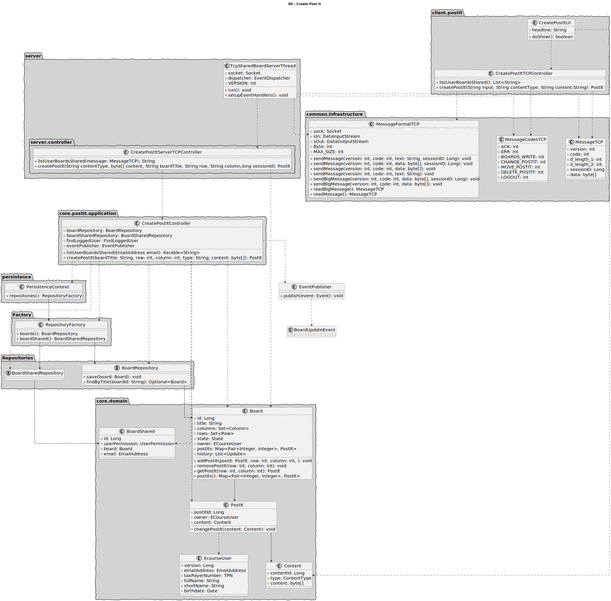

# US 3004

As User, I want to create a post-it on a board

## 1. Context

* First time developing this task.

## 2. Requirements

* Requires synchronization.

## 3. Analysis

*The user should only create Post-Its on board he has writing permissions*

### 3.1 3.1 Acceptance Criteria

This functional part of the system has very specific technical requirements, particularly some concerns about
synchronization problems.
In fact, several clients will try to concurrently update boards.
As such, the solution design and implementation must be based on threads, condition variables and mutexes. Specific
requirements will be provided in SCOMP.

## 4. Design


### 4.1. Realization

#### 4.1.1 System Sequence Diagram


#### 4.1.2 Sequence Diagram


### 4.2. Class Diagram




### 4.1.3 Domain Model


### 4.3. Applied Patterns

Considering the analysis and design of the previous sections, the team decided to apply the following patterns:
- **Dependency Injection** - to inject dependencies
- **Information Expert** - to assign the responsibility of creating the class to the class itself
- **Repository** - to store the classes
- **Pure Fabrication** - to assign the responsibility of coordinating the US to class controller
- **Value Object** - to represent the class attributes that are not entities
- **Singleton** - to ensure that only one instance of the class is created(SynchronizationObject and SessionManager)

### 4.4. Tests

**Test 1:** *Verifies if a slots that is not free, is not free .*

```
    @Test
    public void ensureBoardIsNotFree() {
    BoardBuilder boardBuilder = new BoardBuilder().withTitle("Board2").withState(State.ACTIVE).withOwner(eUser1).withMaxColumns(10).withMaxRows(20);;
    buildBoardColumnsRowsNames(boardBuilder);
    Board board = boardBuilder.build();
    board.addPostIt(new PostIt(new Content(ContentType.TEXT,"Teste".getBytes()), eUser1), 1, 1);
    Assert.assertFalse(board.isFree(1,1));
    }

````
**Test 2:** *Verifies if a slots that is free, is free .*
```
    @Test
    public void ensureBoardIsFree() {
        BoardBuilder boardBuilder = new BoardBuilder().withTitle("Board2").withState(State.ACTIVE).withOwner(eUser1).withMaxColumns(10).withMaxRows(20);;
        buildBoardColumnsRowsNames(boardBuilder);
        Board board = boardBuilder.build();
        Assert.assertTrue(board.isFree(1,1));
    }

````
**Test 3:** *Verify if you cannot add on a row higher than the board max.*
```
    @Test
    public void ensureAddFailWithInvalidRow(){
        BoardBuilder boardBuilder = new BoardBuilder().withTitle("Board2").withState(State.ACTIVE).withOwner(eUser1).withMaxColumns(10).withMaxRows(20);;
        buildBoardColumnsRowsNames(boardBuilder);
        Board board = boardBuilder.build();
        Assert.assertThrows(IllegalArgumentException.class,()->board.addPostIt(new PostIt(new Content(ContentType.TEXT,"Teste".getBytes()), eUser1), 21, 2));
    }
````
**Test 4:** *Verify if you cannot add on a column higher than the board max.*
```
    @Test
    public void ensureAddFailWithInvalidColumn(){
        BoardBuilder boardBuilder = new BoardBuilder().withTitle("Board2").withState(State.ACTIVE).withOwner(eUser1).withMaxColumns(10).withMaxRows(20);;
        buildBoardColumnsRowsNames(boardBuilder);
        Board board = boardBuilder.build();
        Assert.assertThrows(IllegalArgumentException.class,()->board.addPostIt(new PostIt(new Content(ContentType.TEXT,"Teste".getBytes()), eUser1), 2, 21));
    }
````
**Test 5:** *Verify if you cannot add on a row lower than 0.*
```
    @Test
    public void ensureAddFailWithNegativeRow(){
        BoardBuilder boardBuilder = new BoardBuilder().withTitle("Board2").withState(State.ACTIVE).withOwner(eUser1).withMaxColumns(10).withMaxRows(20);;
        buildBoardColumnsRowsNames(boardBuilder);
        Board board = boardBuilder.build();
        Assert.assertThrows(IllegalArgumentException.class,()->board.addPostIt(new PostIt(new Content(ContentType.TEXT,"Teste".getBytes()), eUser1), -2, 2));
    }
````
**Test 6:** *Verify if you cannot add on a column lower than 0.*
```
    @Test
    public void ensureAddFailWithNegativeColumn(){
        BoardBuilder boardBuilder = new BoardBuilder().withTitle("Board2").withState(State.ACTIVE).withOwner(eUser1).withMaxColumns(10).withMaxRows(20);;
        buildBoardColumnsRowsNames(boardBuilder);
        Board board = boardBuilder.build();
        Assert.assertThrows(IllegalArgumentException.class,()->board.addPostIt(new PostIt(new Content(ContentType.TEXT,"Teste".getBytes()), eUser1), 2, -2));
    }
````

## 5. Implementation

*In this section the team should present, if necessary, some evidencies that the implementation is according to the design. It should also describe and explain other important artifacts necessary to fully understand the implementation like, for instance, configuration files.*

*It is also a best practice to include a listing (with a brief summary) of the major commits regarding this requirement.*

## 6. Integration/Demonstration

*In this section the team should describe the efforts realized in order to integrate this functionality with the other parts/components of the system*

*It is also important to explain any scripts or instructions required to execute an demonstrate this functionality*

## 7. Observations

*This section should be used to include any content that does not fit any of the previous sections.*

*The team should present here, for instance, a critical prespective on the developed work including the analysis of alternative solutioons or related works*

*The team should include in this section statements/references regarding third party works that were used in the development this work.*