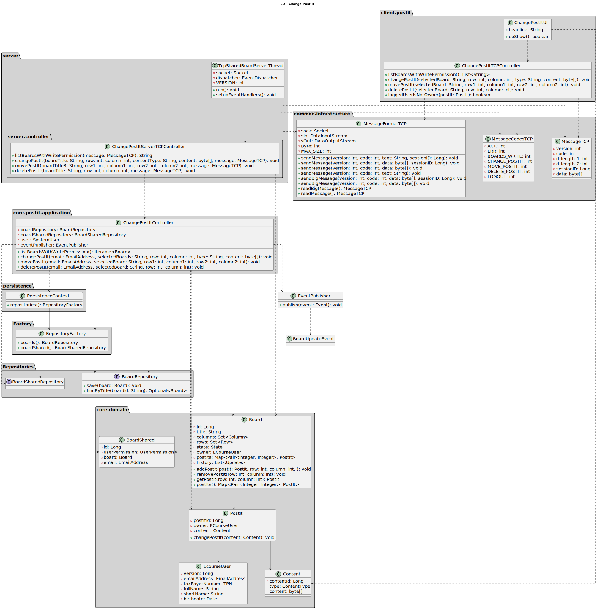

# US 3007

• FRB05 - Change Post-it A user changes a post-it

• NFR13 - Design and Implement Shared Board Synchronization This functional
part of the system has very specific technical requirements, particularly some concerns
about synchronization problems. In fact, several clients will try to concurrently update
boards. As such, the solution design and implementation must be based on threads,
condition variables and mutexes. Specific requirements will be provided in SCOMP

## 1. Context

*It is the first time the task is assigned to be developed.*

## 2. Requirements

**US 3007** As User, I want to change a post-it

**Regarding this requirement we understand that it relates to the following requirements:**

- [US 3002](../../sprintB/us_3002/readme.md) - As User, I want to create a board
- [US 3006](../../sprintB/us_3003/readme.md) - As User, I want to create a post-it

## 3. Analysis

We understand that to change a post it, a board needs to exist;
We also need to have a post it created in that board;
We need to check if the user has write permission on the board and if the post it is empty or owned by the user;
Only one session can edit a post it in a board location at a time , so there needs to be a way to synchronize the access to the board post it;

### 3.1. Requirements Realization

#### 3.1.1. Move PostIt


#### 3.1.2. Edit PostIt


#### 3.1.3. Delete PostIt


## 4. Design

### 4.1. Realization

#### 4.1.1. Move PostIt


#### 4.1.2. Edit PostIt


#### 4.1.3. Delete PostIt


### 4.2. Class Diagram




### 4.3. Applied Patterns

Considering the analysis and design of the previous sections, the team decided to apply the following patterns:
- **Factory Method** - to create the repositories
- **Information Expert** - to assign the responsibility of changing the postIt to its own class
- **Repository** - to store the classes
- **Observer** - to notify the handlers of the changes in the postIts of a board
- **Singleton** - to ensure that only one Session Manager is created and to ensure object synchronization

### 4.4 Tests

#### 4.4.1. Test changePostIt

````
    public void changePostIt() {
        assertEquals(content1, postIt1.content());
        postIt1.changePostIt(content2);
        assertEquals(content2, postIt1.content());
    }
````

#### 4.4.2. Test isOwner

````
    public void isOwner() {
        assertFalse(postIt1.isOwner(student2.identity()));
        assertTrue(postIt1.isOwner(student1.identity()));
    }
````

#### 4.4.3. Test equals

````
    public void equalsTest(){
        PostIt postIt2 = new PostIt(content1, student1);
        PostIt postIt3 = new PostIt(content1, student1);
        PostIt postIt4 = new PostIt(content2, student1);
        assertEquals(postIt2, postIt2);
        assertEquals(postIt2, postIt3);
        assertNotEquals(postIt2, postIt4);
        assertNotEquals(postIt2, null);
        assertNotEquals(postIt2, new Object());
    }
````

#### 4.4.4. Test ensurePostItIsNotCreatedWithNullContent

````
    public void ensurePostItIsNotCreatedWithNullContent() {
        assertThrows(IllegalArgumentException.class, () -> new PostIt(null, student1));
    }
````

#### 4.4.5. Test ensurePostItIsNotCreatedWithNullStudent

````
    public void ensurePostItIsNotCreatedWithNullStudent() {
        assertThrows(IllegalArgumentException.class, () -> new PostIt(content1, null));
    }
````

#### 4.4.6. Test ensurePostItIsCreatedWithValidData

````
    public void ensurePostItIsCreatedWithValidData() {
        PostIt postIt2 = new PostIt(content1, student1);
        assertNotNull(postIt2);
    }
````

## 5. Implementation

### 5.1. ChangePostItUI

```
protected boolean doShow() {
        try {
            String title;
            List<String> boards = controller.listBoardsWithWritePermission();
            do {
                if (!boards.isEmpty()) {
                    SelectWidget<String> boardSelector = new SelectWidget<>("Select one of the boards:", boards);
                    boardSelector.show();
                    title = boardSelector.selectedElement();
                } else {
                    throw new IllegalStateException("You have no boards available");
                }
            } while (title == null);
            //switch case for moving or editing post it
            switch (Console.readInteger("1 - Move Post-it\n2 - Edit Post-it\n3 - Delete Post-it")) {
                case 1:
                    int row1 = Console.readInteger("Insert the current line of the post-it you want to move");
                    int column1 = Console.readInteger("Insert the current column of the post-it you want to edit");
                    int row2 = Console.readInteger("Insert the new line of the post-it you want to move");
                    int column2 = Console.readInteger("Insert the new column of the post-it you want to edit");
                    controller.movePostIt(title, row1, column1, row2, column2);
                    System.out.println("Post-it Moved Successfully");
                    return true;
                case 2:
                    int row3 = Console.readInteger("Insert the line of the post-it you want to edit");
                    int column3 = Console.readInteger("Insert the column of the post-it you want to edit");
                    String contentType;
                    do {
                        SelectWidget<ContentType> contentTypeSelectWidget = new SelectWidget<>("Select the the type of content you want to insert", Arrays.asList(ContentType.values()));
                        contentTypeSelectWidget.show();
                        contentType = contentTypeSelectWidget.selectedElement().toString();
                    } while (contentType == null);
                    String stringContent;
                    byte[] content = null;
                    do {
                        stringContent = Console.readLine("Insert new content (text or image path): ");
                        if (ContentType.TEXT.equals(ContentType.valueOf(contentType)))
                            content = Content.convertTextToByteArray(stringContent);
                        else if (ContentType.IMAGE.equals(ContentType.valueOf(contentType)))
                            content = Content.convertImageToByteArray(stringContent);
                    } while (stringContent == null || stringContent.isEmpty());
                    controller.changePostIt(title, row3, column3, contentType, content);
                    System.out.println("Post-it Edited Successfully");
                    return true;
                case 3:
                    int row4 = Console.readInteger("Insert the line of the post-it you want to delete");
                    int column4 = Console.readInteger("Insert the column of the post-it you want to delete");
                    controller.deletePostIt(title, row4, column4);
                    System.out.println("Post-it Deleted Successfully");
                    return true;
                default:
                    System.out.println("Invalid option");
                    return false;
            }
        }catch (Exception e){
            System.out.println(e.getMessage());
            return false;
        }
    }
````

### 5.2 Major Commits

 - Preliminary version of US3007 SD - 35831b7
 - Preliminary and functional implementation of US for changing a post it - 40a504c
 - Implemented events and event handler to create updates when post its are changed - cad4ce9
 - Altered US 3007 to work with TCP server - 9fab9b0

## 6. Integration/Demonstration

*To execute this functionality, you need to have the TCP and database servers running and then run the client. It is also handy to have the http server running to allow checking for changes in real time.*
*Then you need to login with a user that has write permission on a board and then select the option to change a post it.*
*Then you need to select the board you want to change a post it on and then select the option to change a post it.*
*Then you need to select the type of change you want to make and then insert the information required to make the change.*

*The changes can be confirmed by checking the board using a user that has read permission on the board from a browser.*

## 7. Observations

na.