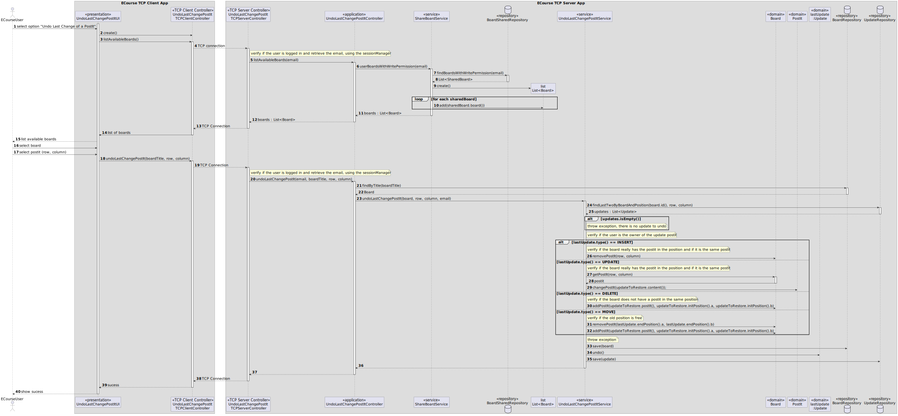

# US 3008

As User, I want to undo the last change in a post-it

## 1. Context

GitHub issue: #38

## 2. Requirements

This functional part of the system has very specific technical requirements, particularly some concerns about synchronization problems.
In fact, several clients will try to concurrently update boards.

As such, the solution design and implementation must be based on threads, condition variables and mutexes. Specific requirements will be provided in SCOMP.

*Regarding this requirement we understand that it relates to...*

- [US 3007](../us_3007/readme.md) - As User, I want to change a post-it
- [US 3006](../us_3006/readme.md) - As User, I want to create a post-it on a board
- [US 3004](../us_3004/readme.md) - As User, I want to share a board
- [US 3002](../../sprintB/us_3002/readme.md) - As User, I want to create a board
- [US 3001](../../sprintB/us_3001/readme.md) - As User, I want the team to prepare the communication infrastructure for Shared Boards and the deployment of the solution

### 2.1. Additional Client Requirements

> **Q:** In this US can we assume that any user can undo the last change in a post-it that any other user made? Or we should allow only the author of a change to undo the change?
> 
> **A:** Page 15: "The user who created a post in a cell can change that post. It may change its contents or move the post into a free cell. The user can also undo the last change."

## 3. Analysis

Regarding this requirement, we understand that because the user can undo the last change,
we need to check the post-it update's history on the board.

The possible updates of the post-it are the following:
 - **MOVE** (move a post-it to another cell of the board)
 - **UPDATE** (update the content of the post-it)
 - **DELETE** (delete the post-it)
 - **INSERT** (create a new post-it)

So, to do this, to undo each of the situations, we need to proceed with the following steps:
- **MOVE** - check if the old position is empty, remove the post-it from the old position and add it to the new position
- **UPDATE** - change the content of the post-it to the old content
- **DELETE** - check if the old position is empty, and re-add it
- **INSERT** - remove the post-it from the board

Also, in all the situations, we need to check if the user is the author of the last change.

### 3.1. Domain Model Extract


## 4. Design

### 4.1. Realization

### 4.1.1. System Sequence Diagram


### 4.1.2. Sequence Diagram



### 4.2. Class Diagram


### 4.3. Applied Patterns

Considering the analysis and design of the previous sections, the team decided to apply the following patterns:
 - **Dependency Injection** - to inject the board and the update repository into the undo service
 - **Repository** - to store the updates of the post-its, the boards and the board sharing
 - **Singleton** - to create the SyncronizationObject, and guarantee synchronization between threads while writing on the board
 - **Service Layer** - to provide a service to undo the last change in a post-it

### 4.4. Tests

Since this requirement is related to the previous ones, that we only need to undo the last change, 
and its only needed to create tests to the domain classes, we decided to not create new tests exclusively for this requirement.

However, here are the major tests relative to domain classes used in this US: 

* **Test 1** Change the content of a post-it

````
    @Test
    public void changePostIt() {
        assertEquals(content1, postIt1.content());
        postIt1.changePostIt(content2);
        assertEquals(content2, postIt1.content());
    }

````

* **Test 2** 


## 5. Implementation

The implementation of this requirement was based on the design presented in the previous section.

The implementation of the main method of the undo service is presented below:

    public void undoLastChangePostIt(Board board, int row, int column, EmailAddress email) {
        List<Update> updates = updatesRepo.findLastTwoByBoardAndPosition(board.id(), row, column);
        if (updates.isEmpty()) throw new IllegalStateException(String.format("No updates found for postit at row %d and column %d on board %s", row, column, board.board_title()));
        CellUpdate updateToRestore = (CellUpdate) updates.get(Integer.min(1, updates.size() - 1));
        CellUpdate lastUpdate = (CellUpdate) updates.get(0);
        Preconditions.ensure(updateToRestore.postIt().isOwner(email), String.format("%s is not the owner of the post-it (%d-%d)", email, row, column));
        switch (lastUpdate.type()) {
            case INSERT:
                Preconditions.ensure(!board.isFree(row, column), String.format("Does not exist a postit at row %d and column %d on board %s", row, column, board.board_title()));
                Preconditions.ensure(board.getPostIt(row, column).isOwner(email), String.format("%s is not the owner of the post-it (%d-%d)", email, row, column));
                if (board.removePostIt(row, column) == null)
                    throw new IllegalArgumentException(String.format("Tried to removed not found postit at row %d and column %d on board %s",
                            row, column, board.board_title()));
                break;
            case UPDATE:
                Preconditions.ensure(!board.isFree(row, column), String.format("Does not exist a postit at row %d and column %d on board %s", row, column, board.board_title()));
                PostIt postit = board.getPostIt(row, column);
                Preconditions.ensure(postit.isOwner(email), String.format("%s is not the owner of the post-it (%d-%d)", email, row, column));
                postit.changePostIt(updateToRestore.content());
                break;
            case DELETE:
                if (!board.isFree(row, column))
                    throw new IllegalArgumentException(
                            String.format("Tried to reinsert postit in occupied position at row %d and column %d on board %s",
                                    row, column, board.board_title()));
                board.addPostIt(updateToRestore.postIt(), updateToRestore.initPosition().a, updateToRestore.initPosition().b);
                break;
            case MOVE:
                if (!board.isFree(updateToRestore.initPosition().a, updateToRestore.initPosition().b))
                    throw new IllegalArgumentException(
                            String.format("Tried to move postit to occupied position at row %d and column %d on board %s",
                                    updateToRestore.initPosition().a, updateToRestore.initPosition().b, board.board_title()));
                if (board.removePostIt(row, column) == null) throw new IllegalStateException(String.format("Tried to removed not found postit at row %d and column %d on board %s", row, column, board.board_title()));
                board.addPostIt(updateToRestore.postIt(), updateToRestore.initPosition().a, updateToRestore.initPosition().b);
                break;
        }
        boardsRepo.save(board);
        lastUpdate.undo();
        updatesRepo.save(lastUpdate);
    }

The major commits regarding this requirement are the following:

 - [819dd04] #38 Corrected SD; Added new Service and Controller; Added new methods on UpdateRepository and its implementations; Other small changes;
 - [44e4cd2] #38 Corrected SD and respective Methods (changed how to persist the update after the undo, and added undo attribute on Update)
 - [a219b0f] #38 Corrected errors relating undo of move operations, and made necessary changes;

## 6. Integration/Demonstration

*In this section the team should describe the efforts realized in order to integrate this functionality with the other parts/components of the system*

*It is also important to explain any scripts or instructions required to execute an demonstrate this functionality*

## 7. Observations

*This section should be used to include any content that does not fit any of the previous sections.*

*The team should present here, for instance, a critical prespective on the developed work including the analysis of alternative solutioons or related works*

*The team should include in this section statements/references regarding third party works that were used in the development this work.*