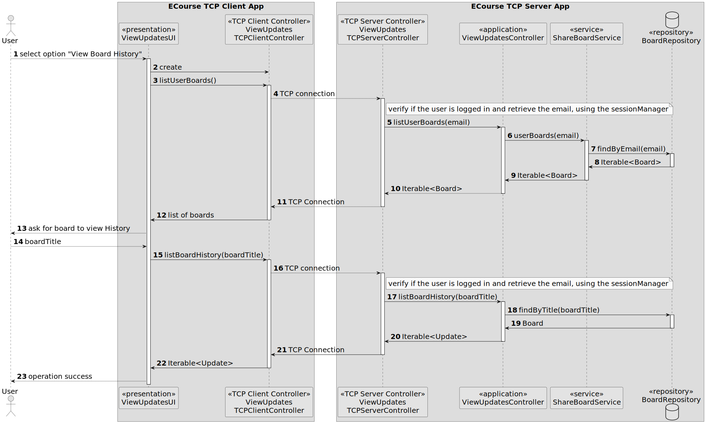

# US 3009

*As User, I want to view the history of updates on a board*

## 1. Context

*This is the first time that is issue will be addressed, since it was only introduced in Sprint C.*
## 2. Requirements

*The requirement is related to US3002 - "As a User, I want to create a board", since the user can only view the updates of a board that exists.*


**US 3009** As an User, I Want to view the history of updates on a board.
* FRB07 - View Board History A user views a history of updates in a board
* NFR13 - Design and Implement Shared Board Synchronization This functional
  part of the system has very specific technical requirements, particularly some concerns
  about synchronization problems. In fact, several clients will try to concurrently update
  boards. As such, the solution design and implementation must be based on threads,
  condition variables and mutexes. Specific requirements will be provided in SCOMP.

## 3. Analysis

*The system should allow the user to view the history of updates on a board that he owns*
*The system should allow the user to view the history of updates on a board that he has reading permissions*


## 4. Design

*In this sections, the team should present the solution design that was adopted to solve the requirement. This should include, at least, a diagram of the realization of the functionality (e.g., sequence diagram), a class diagram (presenting the classes that support the functionality), the identification and rational behind the applied design patterns and the specification of the main tests used to validade the functionality.*

### 4.1. Realization

### 4.2. Class Diagram


### 4.3. Applied Patterns
- **Service** - to get the boards from the repository
- **Repository** - to store the boards
- **Factory Method** - to create the repositories
- **Singleton** - to ensure that only one Session Manager is created and to ensure object synchronization
### 4.4. Tests

**Test 1:** *Verifies that it is not possible to associate an update to an archive board.*

```
 @Test
    public void ensureUpdateIsNotAssociatedWithArchivedBoard(){
        BoardUpdate testBoardUpdate = new BoardUpdate(boardChange1,BoardUpdateType.CREATE,eUser1);
        Assert.assertFalse(testBoardUpdate.associateBoard(board1));
    }
````

## 5. Implementation
public class ViewUpdatesController {
private final RepositoryFactory repositoryFactory;

    private final ShareBoardService shareBoardService;

    public ViewUpdatesController() {
        repositoryFactory= PersistenceContext.repositories();
        shareBoardService=new ShareBoardService();
    }
    public Iterable<Board> listUserBoards(EmailAddress email) {
       Iterable<Board> boards= shareBoardService.userBoards(email);
       if(!boards.iterator().hasNext()){
           throw new IllegalStateException("User has no active boards associated!");
       }
         return boards;
    }
    public Iterable<Update> listBoardHistory(String board){
        BoardRepository repoBoards=repositoryFactory.board();
        Board b=repoBoards.findByTitle(board).orElseThrow();
        return b.history();
    }
}

## 5.2 Major Commits
* Preliminary Documentation- 9ee0c93;82bdba9
* Implementation - 1426d64
* Migration to TCP - 4ba5295
* Updated Documentation - b26f1a1

## 6. Integration/Demonstration

*In this section the team should describe the efforts realized in order to integrate this functionality with the other parts/components of the system*

*It is also important to explain any scripts or instructions required to execute an demonstrate this functionality*

## 7. Observations
na