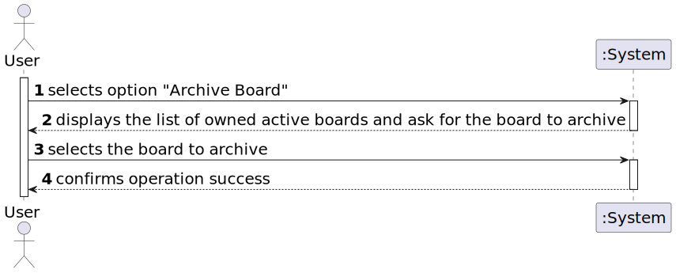

# US 3010

*As User, I want to archive a board I own*

## 1. Context

*This is the first time that is issue will be addressed, since it was only introduced in Sprint C.*
## 2. Requirements
**US 3010** *As an User, I Want to archive a board I own.*
- FRB08 - Archive Board The owner of a board can archive the board
- NFR13 - Design and Implement Shared Board Synchronization This functional
  part of the system has very specific technical requirements, particularly some concerns
  about synchronization problems. In fact, several clients will try to concurrently update
  boards. As such, the solution design and implementation must be based on threads,
  condition variables and mutexes. Specific requirements will be provided in SCOMP.


## 3. Analysis

*The system should allow the user to archive an active board that he owns*



## 4. Design

*In this sections, the team should present the solution design that was adopted to solve the requirement. This should include, at least, a diagram of the realization of the functionality (e.g., sequence diagram), a class diagram (presenting the classes that support the functionality), the identification and rational behind the applied design patterns and the specification of the main tests used to validade the functionality.*

### 4.1. Realization


### 4.2. Class Diagram


### 4.3. Applied Patterns
- **Repository** - to store the boards
- **Information Expert** - to assign the responsibility of archiving the board to the class itself
- **Factory Method** - to create the repositories
- **Singleton** - to ensure that only one Session Manager is created and to ensure object synchronization

### 4.4. Tests

**Test 1:** *Verifies that it is not possible to create an instance of the Board class with invalid State.*

```
 @Test
    public void ensureBoardIsNotCreatedWithInvalidState(){
        Assert.assertThrows(IllegalArgumentException.class,()->new Board(title2,null,eUser2));
    }
````

**Test 2:** *Verifies that it is not possible to create an instance of the Board class with invalid Title.*

```
 @Test
    public void ensureBoardIsNotCreatedWithInvalidTitle(){
        Assert.assertThrows(IllegalArgumentException.class,()->new Board(null,state1,eUser1));
    }
````
**Test 3:** *Verifies that it is not possible to create an instance of the Board class with invalid Owner.*

```
 @Test
    public void ensureBoardIsNotCreatedWithInvalidECourse(){
        Assert.assertThrows(IllegalArgumentException.class,()->new Board(title1,state1,null));
    }
````


## 5. Implementation
public class ArchiveBoardController {
private RepositoryFactory repositoryFactory= PersistenceContext.repositories();
private AuthorizationService authz;
private Iterable<Board> ownedActiveBoards;

    public ArchiveBoardController() {
        repositoryFactory= PersistenceContext.repositories();
        authz= AuthzRegistry.authorizationService();
        ownedActiveBoards=new ArrayList<>();
    }
    public Iterable<Board> listActiveBoards(EmailAddress email){
        BoardRepository repo=repositoryFactory.boards();
        ownedActiveBoards=repo.findActiveByOwner(email);
        if(!ownedActiveBoards.iterator().hasNext()){
            throw new IllegalStateException("User has no active boards associated!");
        }
        return ownedActiveBoards;
    }
    public Board archiveBoard(String sBoard){
        Board board = repositoryFactory.board().findByTitle(sBoard).orElseThrow();
        board.archive();
        BoardRepository repo=repositoryFactory.boards();
        return repo.save(board);
    }
}

## 5.2 Major Commits
* Preliminary Documentation - d89dfb4
* Added Implementation - eb5ef4d
* Migration to TCP - 681ca37
* Updated Documentation - 5a8c0d9

## 6. Integration/Demonstration

*In this section the team should describe the efforts realized in order to integrate this functionality with the other parts/components of the system*

*It is also important to explain any scripts or instructions required to execute an demonstrate this functionality*

## 7. Observations
na